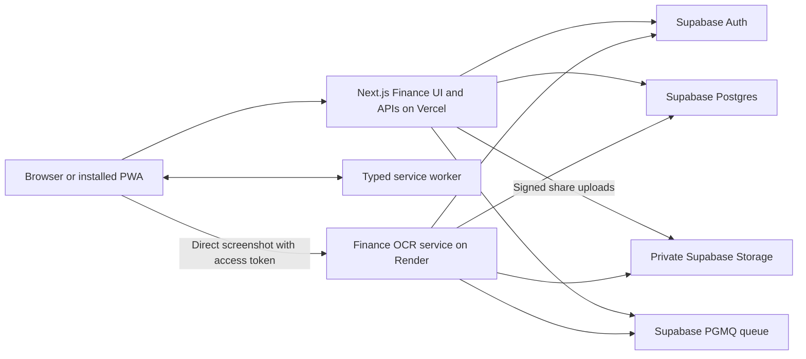
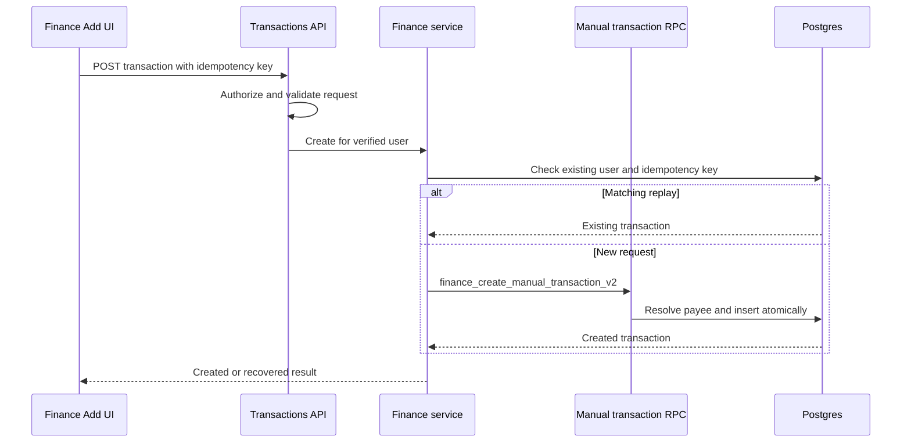
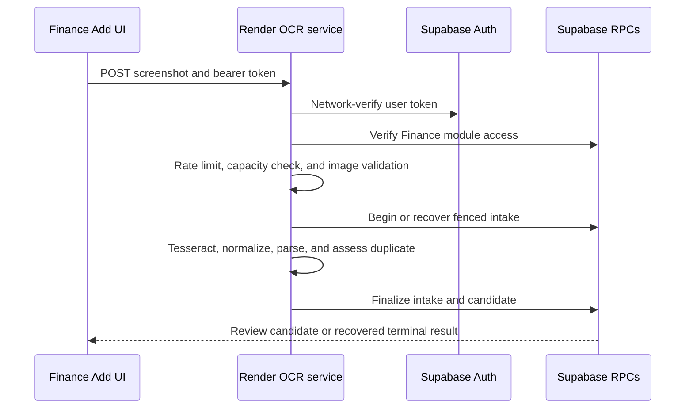
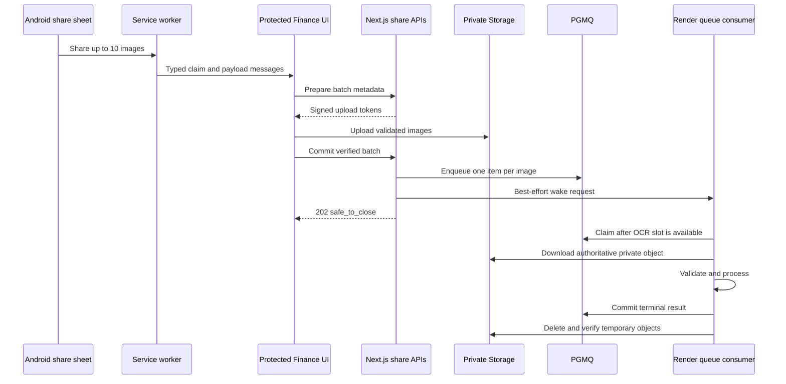
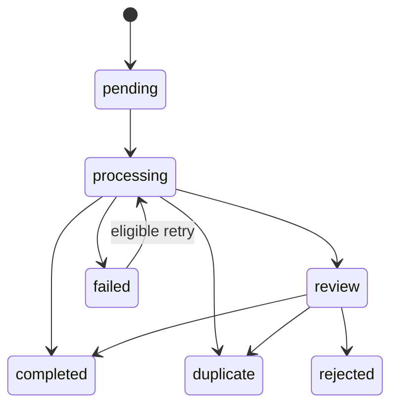
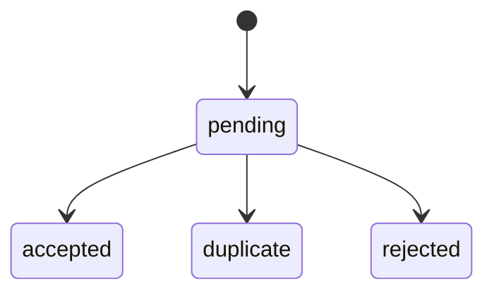

# Finance Module

## Document purpose

This document describes the Finance module, including budgeting added on 2026-09-14. It is intended for engineers, reviewers, operators, and future maintainers who need to understand the module without reconstructing its behavior from individual pages, route handlers, migrations, and OCR service files.

The code and forward database migrations remain the source of truth. When behavior changes, update this document in the same change.

## Module scope

Finance is a personal transaction ledger with two entry paths:

1. Manual transaction entry.
2. Screenshot OCR, either as a direct upload or as a durable Android PWA share batch.

The module provides:

- Monthly cash-flow reporting.
- Recurring personal budgets with current progress and frozen cycle history.
- Expense breakdowns by category.
- A searchable and editable confirmed transaction ledger.
- A review queue for OCR candidates and duplicate decisions.
- Source, category, and parsing-rule configuration.
- Merchant and payee distinction.
- Deterministic duplicate detection.
- Correction recording and narrowly scoped rule learning.

The current product is not a bank integration, bookkeeping system, or multi-currency accounting platform. Finance v1 supports MYR only.

## Personal budgets

`/finance/budgets` supports weekly, monthly, and custom 1-to-365-day MYR budgets. The Finance sidebar links to it. The server-rendered Finance dashboard adds `active_budgets` through its existing service, independently of the selected reporting month. It ranks all active budgets by over budget, limit reached, needs attention, on track, then exact usage, and returns at most three. No dashboard HTTP endpoint is reintroduced.

Budget creation opens with name, amount and weekly/monthly cycle only. Monthly defaults to the 1st of the current month; weekly defaults to the current week's Monday, both in the captured time zone. Spending earlier in that current period counts immediately. Customize exposes dates, custom durations, source/category selections and filter logic. Dates within the current calendar period or later are accepted for new and scheduled weekly/monthly budgets. Custom durations and restoration retain today-or-later starts. Editing an existing budget preserves its schedule unless the user changes it.

### Storage and lifecycle

`finance_budgets` holds owner, stable identity, name, optimistic revision, creation request UUID, lifecycle and current version. `finance_budget_versions` records immutable configuration. Selection tables reference the existing Finance dimensions through tenant-safe relationships, retaining original IDs and labels when archived-budget references are deleted. Cycles have one open row per budget. Completed and partial cycles retain frozen totals and labels in `finance_budget_cycles` and `finance_budget_cycle_breakdowns`. They contain no transaction snapshots.

Confirmed transactions count by their ledger date within inclusive-start/exclusive-end boundaries. Selection OR applies within each dimension; configured AND/OR applies only when both dimensions have selections. Empty filters match everything, including Uncategorised. Selected archived dimensions continue to count. Net spending is expenses minus income; negative net remains visible, with zero usage and remaining capped at the limit. Money uses exact decimal strings across budgeting APIs and BigInt minor units in browser formatting. Status comparisons use exact values before percentage rounding.

Stored IANA time zones determine local today. Pace counts completed calendar days, so first-day pace is zero. Monthly boundaries clamp to month end while retaining their original anchor. Editing a monthly renewal day starts today with a shorter first cycle if needed. Name, amount and filter edits retain the open cycle's start and recalculate it. Schedule edits freeze through yesterday; zero-day partials are discarded. Archive freezes through today from the ledger visible during the atomic operation, excluding future dates. Same-day restoration is supported and starts an independent schedule. Deleted selections must be explicitly repaired before restore.

`lib/finance/budgets/` owns validation, pure calculations, services and server-only RPC access. All mutations and reconciliation coordinate through the existing per-user Finance ledger advisory lock before locking budgets and references. The row-lock, FK and deletion-trigger combination prevents reference deletion from racing successful creation or restore. Budget creation is idempotent per user/request UUID; changed payload reuse conflicts. Edits, archive and restore require the current revision. Budget reads reconcile overdue cycles before calculating current data. Frozen history cannot be updated or extended afterward, including after late or edited ledger entries. Existing account-deletion retention cascades remain supported.

Budget details present schedule and filter selections in a two-column table. Current transactions use a keyboard-accessible disclosure that starts collapsed for each selected budget. The shared `ActionMenu` exposes Edit, Archive and Cycle history; frozen history opens in `FormDialog`, retaining independent pagination and showing read errors inside the dialog. Restore remains available for archived budgets. Successful saves and archival use the shared dismissible `Toast`, which expires after five seconds and pauses while hovered or focused. Progress retains its pace marker without a separate elapsed-days sentence.

The authorized server page collects all budget summaries across states using the existing `state=all` list contract in batches of at most 100. The client filters Active, Scheduled and Archived locally and paginates each section at 20 items without network requests. It loads no detail by default; selecting a budget requests only its detail endpoint, while an explicit budget URL remains supported on the server. History and transaction pagination also request only details. Switching sections cancels pending details and ignores late responses. Summaries remain in component memory until page navigation, an explicit Refresh budgets action, or a successful mutation refreshes the list. Failed refreshes retain the last loaded summaries with a retryable error. Opening details reconciles the selected budget and updates its summary; all server reads retain authorization and database reconciliation.

### Budget interfaces

| Interface | Request and response |
|---|---|
| `GET /api/finance/budgets` | `state=active\|scheduled\|archived\|all`, `page`, `page_size`; returns `{ data, page, page_size, total }` |
| `POST /api/finance/budgets` | `{ request_id, configuration }`; returns `{ data: budget }` |
| `PUT /api/finance/budgets` | `{ id, revision, configuration }`; returns `{ data: budget }` |
| `GET /api/finance/budgets/[id]` | Independent `history_page`, `history_page_size`, `transactions_page`, `transactions_page_size`; returns `{ data: { budget, history, transactions } }` |
| `PATCH /api/finance/budgets/[id]` | Archive: `{ action: 'archive', revision }`. Restore: `{ action: 'restore', revision, configuration }` |

Configuration includes `name`, decimal-string `amount`, `cycle_type`, `start_date`, nullable `custom_days` and `anchor_day`, captured `time_zone`, `filter_logic`, `source_ids`, `category_ids`, and `include_uncategorised`. Time zone is preserved on edits/restores. Server services derive ownership from `authorizeFinance`; browser-provided user IDs, calculated fields and cycle states are not accepted. Field validation uses safe 422 errors, stale writes/name conflicts use 409, and other users' IDs return 404. Defaults are 20 budgets/history items and 50 transactions, with a maximum page size of 100.

### Budget rollout and operations

Apply `20260914093154_finance_budgets.sql` using the versioned CLI workflow in `supabase/README.md`, then deploy the application. The migration requires the existing approved Cron installation and registers one hourly `finance-budget-closure` job. Its global worker is operator-only, coordinates overlapping invocations, skips busy owners for retry, and logs only a budget ID and SQLSTATE on per-budget failure. Application reads also catch up missed cycles. No new browser secrets are required.

The simplified creation form also requires `20260915034305_finance_budget_calendar_starts.sql`. This forward migration relaxes only the new/scheduled weekly and monthly start-date guard to the current period boundary. It keeps existing schedules, ledger data, frozen history, function privileges, idempotency and restoration behavior unchanged. Apply it before using the updated form.

RPCs execute as the trusted server role. Three trigger-only guards use a fixed empty search path and definer privileges solely to enforce immutability/reference integrity while allowing existing Auth account-deletion cascades, without granting the service role access to `auth.users`.

Before rollout, verify table grants, restrictive RLS policies, function execution grants, and the active cron command. Monitor `cron.job_run_details` through [Supabase Cron monitoring](https://supabase.com/docs/guides/cron), PostgreSQL closure warnings and the worker's overdue-cycle count warnings, since a successful job status alone does not establish that every budget closed. An operator backlog query is:

```sql
select count(*) as overdue_cycles
from public.finance_budget_cycles c
join public.finance_budget_versions v on v.id = c.version_id and v.user_id = c.user_id
where c.frozen_at is null and c.end_date <= (now() at time zone v.time_zone)::date;
```

Rollback disables the budgeting page/sidebar/dashboard integration and cron job before reverting application usage. Preserve budget tables, versions and frozen history. Never replay the adopted schema baseline over production.

### Budget validation

Use Node 22.22.0. `npm run test:finance-budgets` runs domain, route, service and component tests. `npm run test:finance-budgets:browser` runs real controls and styles in a test-only local harness on port 4179, with synthetic REST responses and a sans-serif fallback font. It covers desktop/mobile lifecycle actions, deleted selections, conflicts, keyboard focus and 200 percent CSS scaling. It does not authenticate to or write production data. Install its pinned browser using `npx playwright install chromium`.

`npm run test:finance-budgets:db` runs rollback-only SQL lifecycle/security tests plus independent PostgreSQL sessions for concurrent creation, stale edits, closure overlap and deletion races. Set `FINANCE_BUDGET_TEST_DATABASE_URL` to a disposable loopback database with the adopted baseline and forward migrations applied, and `FINANCE_BUDGET_TEST_PSQL` to a compatible psql executable. The runner refuses non-loopback connections and removes its committed synthetic concurrency user afterward. The same lifecycle SQL can be run manually on isolated Supabase staging.

Local validation used PostgreSQL 17 with the adopted Finance schema and the forward budgeting migration. Hosted Auth/Storage metadata and Cron were local scaffolding; the cron registration and callable worker were checked, but no real cron scheduler ran. Hosted Supabase scheduling, platform advisors and representative-volume query plans remain deployment checks. Run all repository checks in addition to these feature suites.

Validation on 2026-09-15 used Node 22.22.0. All 328 repository tests passed, including 65 budgeting unit/route/service/component/page tests and four shared toast/action-menu tests. Fourteen desktop/mobile browser tests, Finance security/idempotency/ordering/share regressions, lint, TypeScript checking and production build passed. The isolated database lifecycle/concurrency suite passed during the lifecycle implementation; the subsequent client loading changes did not alter database behavior. Calendar tests cover current-week/month starts, time zones, earlier spending, rejected prior periods, custom options and preserved restore boundaries. UI checks cover collapsed transactions, keyboard menu navigation, dialog focus return, history pagination with failed reads, and local section switching and pagination, summary refresh failures, explicit detail loading, and ignored out-of-order responses. Both dependency audits reported zero vulnerabilities.

### Production database deployment, 2026-09-15

With explicit user approval, the CLI applied only `20260914093154_finance_budgets.sql` to `xcaxukhjkqqnmzziqrkc`. The subsequent dry run reported no pending migrations. This resolves the local app's `PGRST202` failure caused by the previously absent budgeting functions. The app's server credentials successfully called both list and dashboard RPC variants over the Data API with HTTP 200, using a nonexistent test owner and creating no user data.

The CLI subsequently applied `20260915034305_finance_budget_calendar_starts.sql` for the simplified creation form. The main-branch merge had introduced an unrelated pending OCR migration, so an isolated deployment directory contained exact repository copies of the recorded remote migrations and only this new budgeting migration. Its preview and apply output both listed only the calendar-start migration. Remote verification confirmed the migration record, updated date guard, invoker security, empty search path, denied browser execution and permitted service-role execution. The unrelated OCR migration remains pending.

All six budget tables have RLS enabled and deny browser table access. All 18 budget functions deny browser execution, the server can mutate budgets, and the global worker remains operator-only. Cron job 3, `finance-budget-closure`, is active hourly with a 90-second timeout. Its first scheduled execution had not occurred at verification time; monitoring `cron.job_run_details` remains necessary.

After the calendar-start deployment, the hourly job remained active and the closure backlog was zero. No scheduled execution was recorded yet. The advisor results remained unchanged, with no budgeting security findings and the performance follow-ups below.

The hosted security advisor reported no budgeting findings. Its performance advisor reported four informational [composite foreign-key index suggestions](https://supabase.com/docs/guides/database/database-linter?lint=0001_unindexed_foreign_keys), for the cycle-to-budget, breakdown-to-cycle, and two selection-to-version relationships. These are follow-up performance review items, alongside representative-volume query plans. Newly created indexes were also reported unused, which is expected before budget traffic. This deployment changed the database only; production application deployment remains separate.

## System context

Finance spans three deployed runtimes and one generated PWA artifact:



### Runtime responsibilities

| Runtime | Responsibilities |
| --- | --- |
| Next.js application | Finance pages, session and module authorization, request validation, manual and review workflows, dashboard aggregation, signed share-upload preparation, queue commit, and active-batch status. |
| Finance OCR service | Image validation, Tesseract lifecycle, OCR normalization, parsing, duplicate assessment, durable queue consumption, retry handling, optional guarded auto-confirmation, and cleanup coordination. |
| Supabase | Authentication, tenant-owned Finance data, atomic mutation RPCs, correction evidence, scheduled learning, private Storage, queue state, locking, fencing, and row-level security. |
| Service worker | Receives Android PWA share-target files, keeps them temporarily until the protected Finance UI claims them, and uses the shared typed message protocol. |

## Repository structure

| Path | Ownership |
| --- | --- |
| [`app/finance/`](../app/finance/) | User-facing Finance routes and route-owned components. |
| [`app/api/finance/`](../app/api/finance/) | Thin authenticated HTTP adapters. |
| [`lib/finance/core/`](../lib/finance/core/) | Finance authorization helpers, request security, validation, browser API client, repository access, and business services. |
| [`lib/finance/transactions/`](../lib/finance/transactions/) | Duplicate assessment, URL filters, ordering, idempotency, and payee-classification behavior. |
| [`lib/finance/ocr/`](../lib/finance/ocr/) | Pure OCR normalization, source detection, parsing, reference extraction, recipient-reference handling, and learned field transforms. |
| [`lib/finance/share/`](../lib/finance/share/) | Share protocol, file validation, signed-upload client, worker messaging, and server wake behavior. |
| [`services/finance-ocr/`](../services/finance-ocr/) | Independently deployed Node.js OCR and queue-consumer service. |
| [`service-worker/sw.ts`](../service-worker/sw.ts) | Editable typed service-worker source. |
| [`public/sw.js`](../public/sw.js) | Generated service-worker deployment artifact. Do not edit directly. |
| [`supabase/migrations/`](../supabase/migrations/) | Canonical forward database migrations. |
| [`tests/`](../tests/) | Web, API, security, validation, payee, filter, idempotency, ordering, and share-flow tests. |

## User-facing routes

| Route | Purpose |
| --- | --- |
| `/finance` | Monthly dashboard, cash-flow chart, category spending chart, and recent transactions. |
| `/finance/add` | Manual transaction entry, direct screenshot upload, and accepted PWA share files. |
| `/finance/transactions` | Confirmed transaction ledger, search, filters, edit, and delete. |
| `/finance/review` | Pending OCR candidates, failed intakes, duplicate decisions, retry rules, confirmation, and rejection. |
| `/finance/settings?section=sources` | Source names, filename aliases, OCR aliases, archive, restore, and safe deletion. |
| `/finance/settings?section=categories` | Shared categories, default suggestions, archive, restore, and safe deletion. |
| `/finance/settings?section=rules` | Manual rules, learned rules, and pending learning suggestions. |

`/finance/sources`, `/finance/categories`, and `/finance/rules` are compatibility redirects to the matching Finance Settings section.

### Dashboard behavior

The dashboard accepts a `YYYY-MM` month and computes:

- Total expenses.
- Total income.
- Net cash flow.
- Number of intake items awaiting review.
- Expense totals grouped by category, including Uncategorised.
- Daily income and expense totals.
- Six most recent confirmed transactions.

The cash-flow and category panels have equal layout height. Their charts are navigation controls:

- Selecting an income bar, expense bar, or date tick opens the ledger filtered to that exact date.
- Selecting a category segment or category row opens the ledger filtered to that category.
- Selecting Uncategorised filters for transactions whose `category_id` is null.
- Chart interactions include keyboard activation and accessible labels.

Chart colors come from the dashboard presentation palette. Categories do not store color or icon metadata.

### Transaction ledger behavior

The ledger loads confirmed transactions by default and supports:

- Free-text search across merchant, payee name, transaction reference, and notes.
- Source filtering.
- Category filtering.
- Uncategorised filtering.
- Exact transaction-date filtering.
- Filter chips that show and clear URL-derived filters.
- Editing and deletion of confirmed ledger transactions.

Results are sorted by transaction date descending, creation time descending, then ID ascending. Repository reads are paginated internally so the service can return the complete matching result set without relying on the default PostgREST row limit.

## Finance access and security

### Page authorization

[`app/finance/layout.tsx`](../app/finance/layout.tsx) is the protected Finance boundary. It:

1. Loads the current authenticated user and application access.
2. Redirects signed-out users to `/login`.
3. Redirects authenticated users without Finance access to `/dashboard`.
4. Mounts the Finance share-target provider only inside the authorized Finance route tree.
5. Mounts the Finance reference-data provider at the same module boundary.

Pending, unsubmitted shared files are discarded when the user leaves the Finance layout. They are not forwarded to another module.

### Module-scoped reference data

[`FinanceReferenceDataProvider`](../app/finance/_components/FinanceReferenceDataProvider.tsx) loads the active source and category options once when the authorized Finance layout mounts. The consolidated payload contains only `id` and `name`, and the provider reuses it while the user navigates among Finance pages. Leaving Finance unmounts the provider; returning creates a fresh request.

Add, Review, Transactions, and Rules consume this shared state instead of independently loading the same option lists. Dashboard and ledger results remain page-owned and are not blocked by reference-data loading. Controls that need a source or category show a local loading or retry state. Concurrent refresh calls share one request, a failed refresh preserves the last successful options, and pending responses are aborted and ignored after unmounting.

Settings remains intentionally separate from the minimal payload. Only the active Settings section is rendered. Sources then loads aliases and archive state, Categories loads archive state, and Rules loads rules, suggestions, and a privacy-safe learning summary together in one authenticated request while reusing the provider options. Successful create, rename, archive, restore, and delete operations update both the detailed Settings list and the active provider options.

### API authorization

Finance API routes do not depend on page middleware for authorization. Every handler calls `authorizeFinance()` and receives a verified user before invoking a service.

For unsafe HTTP methods, [`lib/finance/core/requestSecurity.ts`](../lib/finance/core/requestSecurity.ts) rejects:

- Requests reported by the browser as cross-site.
- Requests whose `Origin` does not match the current application origin.
- Malformed origins.
- JSON mutation routes whose content type is not `application/json`.

This guard is Finance-owned because it currently protects Finance mutation routes and has not yet been standardized as a repository-wide API policy.

### Database access

The browser does not receive direct Data API access to Finance application tables. Current Finance tables have RLS enabled, restrictive deny policies for browser roles, and direct grants revoked. Trusted server code uses the service-role or secret client only after authentication and module authorization.

Every trusted query is explicitly scoped by the verified `user_id`. Ownership is also reinforced through tenant-safe foreign keys and RPC checks. A service-role client is not treated as a substitute for tenant filtering.

### Atomic operations

Business-critical transitions use reviewed Postgres functions for:

- Manual transaction creation.
- Transaction update and deletion.
- Candidate confirmation, rejection, and duplicate marking.
- Source and category archive or deletion checks.
- Payee resolution.
- OCR intake begin, finalize, and failure.
- Share-batch preparation, commit, claim, retry, completion, and cleanup.

The functions use row locks, a per-user ledger advisory lock where required, idempotent replay behavior, and processing-attempt fencing to prevent concurrent requests from creating divergent state.

### Secret boundaries

- `SUPABASE_SERVICE_ROLE_KEY` is server-only in the Next.js runtime.
- `SUPABASE_SECRET_KEY` is server-only in the Render runtime.
- `FINANCE_QUEUE_WAKE_SECRET` is shared only between the Next.js server and Render.
- Supabase access tokens are sent to Render only to authenticate direct user OCR requests.
- No secret may use a `NEXT_PUBLIC_` prefix.

## Domain model

### Transaction

A confirmed Finance transaction contains:

| Field | Behavior |
| --- | --- |
| `user_id` | Required tenant owner. |
| `source_id` | Required user-owned source. |
| `category_id` | Optional user-owned category. The same category may be used for expense and income transactions. |
| `intake_item_id` | Optional link to screenshot lineage. Manual transactions have no intake item. |
| `manual_idempotency_key` | Present on manual entries so request retries cannot create a second ledger row. |
| `direction` | `expense` or `income`. |
| `amount` | Positive value with at most two decimals, up to `999999999999.99`. |
| `currency` | `MYR`. |
| `merchant` | Optional merchant or commercial context, maximum 500 characters. |
| `payee_id` | Optional link to the user's canonical payee catalog. |
| `reference_number` | Optional normalized transaction reference, maximum 200 characters. |
| `transaction_date` | Valid calendar date that cannot be in the future at mutation time. |
| `notes` | Optional free-form text, maximum 2,500 characters. OCR recipient references are stored here. |
| `source` | `manual` or `screenshot`. |
| `status` | The ledger normally reads `confirmed`; the shared type also describes review, duplicate, and rejected states used across Finance contracts. |

### Source

A source represents the account, card, wallet, bank, or origin of a transaction. It has:

- A user-owned canonical name.
- Up to 20 normalized filename aliases.
- Up to 20 normalized OCR-text aliases.
- An archive state.

Archived sources remain available to historical transactions. New transactions and review confirmations require an active source. Deletion is allowed only when no dependent Finance record references the source.

### Category

Categories form one user-owned library shared by expense and income transactions and rules. Category records store a name and archive state, not direction, color, or icon metadata. Food, Drinks, Transport, and Gifts are virtual shared suggestions until the user first selects or creates them.

Category names are unique per user after case-insensitive trimming. Archived categories remain available to historical transactions. A transaction may be uncategorised. Deletion is allowed only for categories with no transaction, rule, candidate, correction, or suggestion dependencies.

### Merchant and payee

Merchant and payee have different meanings:

- Merchant is the commercial context shown on a receipt or transaction.
- Payee is the person or organization that received the payment.
- A transaction may contain either field, both fields, or neither field.
- Merchant remains optional even when the transaction has a payee.

The form control is labelled `Is a payee`.

When the control is selected and the payee field is empty, an existing merchant value is moved into the payee field and merchant is cleared. When the control is cleared, the payee value is restored to merchant only if merchant is empty, then the payee field is cleared. Existing merchant and payee values are preserved when both are already populated.

When a transaction is saved with a payee name, the atomic database function:

1. Normalizes the name using the tenant-safe payee key.
2. Reuses the user's matching payee if it exists.
3. Reactivates the payee if it was archived.
4. Creates the payee if no match exists.
5. Stores the resolved `payee_id` on the transaction.

Removing a payee from a transaction does not delete the catalog entry. There is currently no standalone payee-management page.

In transaction displays, payee is the primary recipient and merchant is secondary context when both exist.

### Transaction reference and recipient reference

These values intentionally have different persistence behavior:

- A transaction reference is persisted in `reference_number`, normalized to uppercase, searched by the ledger, used by duplicate detection, and eligible for source-specific learned transforms.
- A recipient reference is recognized only during OCR parsing. Its value is conservatively cleaned and prepended to `notes`. There is no persistent `recipient_reference` column.

The migration [`20260813034905_merge_recipient_reference_into_notes.sql`](../supabase/migrations/20260813034905_merge_recipient_reference_into_notes.sql) backfilled existing recipient-reference values into Notes, updated pending candidate payloads, removed the separate field, and installed the current mutation RPC versions.

### OCR intake and candidate

An intake item stores screenshot processing lineage, including:

- User and source type.
- Original filename and image hash.
- Processing status, attempt, lease, and version.
- Raw and normalized OCR text and hashes.
- OCR confidence.
- Detected source and the evidence signals used.
- Failure code, stage, and safe error message.

A candidate stores the parsed payload, candidate confidence, matched rule, duplicate assessment, status, and optional confirmed transaction link.

The current confirmation workflow does not erase stored OCR text. Raw and normalized OCR text remain on the intake record after confirmation. A fresh retry of a failed intake clears prior OCR fields before processing again. Temporary screenshot bytes have a different lifecycle, described under Data retention and cleanup.

## Transaction validation and error handling

The manual, review, and edit workflows share Finance transaction validation from [`lib/finance/core/values.ts`](../lib/finance/core/values.ts) and server request parsers from [`lib/finance/core/schemas.ts`](../lib/finance/core/schemas.ts).

Important validation rules include:

- Source is required and must belong to the user.
- Category is optional and must belong to the user. Category selection is independent of direction.
- Direction must be expense or income.
- Amount must be positive, exact to no more than two decimal places, and within the maximum.
- Transaction date must be a real `YYYY-MM-DD` date and cannot be in the future.
- Merchant is optional and limited to 500 characters.
- Selecting `Is a payee` requires a payee name.
- A payee name cannot be sent unless `Is a payee` is selected.
- Payee name is limited to 500 characters and must contain a letter or number.
- Transaction reference is limited to 200 characters.
- Notes are limited to 2,500 characters.
- Currency must be MYR.

The browser sends `X-Finance-Time-Zone`. The server resolves today's date in that timezone for future-date validation.

Validation failures return HTTP 422 with field errors:

```json
{
  "error": "Check the highlighted fields",
  "field_errors": {
    "payee_name": "Enter the payee name",
    "amount": "Enter a positive amount with at most two decimals"
  }
}
```

The forms keep their primary action available except while saving, show a form summary and inline field messages, focus and scroll to the first invalid field, and clear a field error when that field is corrected.

HTTP 409 is reserved for state conflicts such as duplicate gates, reused idempotency keys with different content, concurrent ledger changes, stale review state, or unavailable referenced records. The typed browser client preserves the status and structured field errors, redirects expired sessions to login, and uses a 20-second default request timeout.

## Manual creation and ledger editing

### Manual creation



The same idempotency key may safely replay only when all normalized transaction details match. Reusing a key for different details returns a conflict.

### Editing

Only confirmed ledger transactions can be edited. The service merges the request with the current record, validates the resulting complete transaction, verifies source and category ownership, and calls `finance_update_transaction_v3`. Payee resolution and correction capture remain atomic with the update.

### Deletion

Deletion calls the tenant-scoped `finance_delete_transaction` RPC. Concurrent ledger mutations are serialized, and a missing transaction is reported as not found.

## Screenshot OCR

### Direct upload flow

The browser sends one multipart `screenshot` file directly to Render with the current Supabase access token.



A newly processed direct upload always creates a review candidate. It does not auto-confirm. If the same image already has a terminal result, the service may recover that result without running OCR again.

### OCR service endpoints

| Method and path | Authentication | Purpose |
| --- | --- | --- |
| `GET /health` | None | Liveness check. Does not initialize Tesseract. |
| `POST /warm` | Supabase bearer token plus Finance access | Initializes or joins the shared Tesseract worker promise. |
| `POST /v1/finance/ocr` | Supabase bearer token plus Finance access | Processes one direct multipart screenshot. |
| `POST /v1/finance/queue/wake` | Server-only wake secret | Starts or joins the background share-queue drain and returns 202. |

### Image validation

The browser share flow and Render service both enforce the main image limits. Render is authoritative before OCR:

- PNG, JPEG, or WebP only.
- One direct file per request.
- Maximum 4 MB per image by default.
- Maximum dimension of 12,000 pixels per side.
- Maximum 25,000,000 total pixels.
- Declared MIME type must match magic bytes.
- Sharp must fully decode the image before Tesseract receives it.
- Filenames are normalized, stripped of control characters, and limited to 255 characters.

Render uses a single shared OCR slot to remain within its memory budget. A simultaneous direct request receives 503 with `Retry-After`. The queue claims work only after the slot is available.

### Text normalization

OCR text is normalized before parsing and hashing. The normalizer provides stable line content for:

- Field extraction.
- Rule matching.
- Source evidence.
- Exact normalized OCR-text duplicate detection.
- Review retry behavior.

The parser is pure TypeScript shared by the Next.js application and the OCR service. Review's `Retry rules` action reparses stored normalized OCR text using the user's current active sources, manual rules, algorithm 2/3 parser templates, and payees.

### Amount extraction

Amount candidates require two decimal places and may include RM, MYR, or comma separators. A candidate gains weight when its line contains terms such as amount, total, paid, payment, purchase, or transfer. Lines referring to balance, available balance, or limit are penalized so account balances are less likely to be selected as transaction amounts.

### Date extraction

The parser recognizes:

- `YYYY-MM-DD`, with slash and dot variants.
- Local day-month-year formats.
- Day plus English month name plus year.

The resulting date must form a real calendar date.

### Direction extraction

Income signals include received, credited, incoming, salary, cashback, and refund. Expense signals include paid, payment, purchase, debited, spent, merchant, and transfer-to wording. A matching rule may fill direction if it has not already been assigned by an earlier matching rule.

### Merchant and payee extraction

The parser treats the fields separately:

- `Merchant` or `Merchant name` labels populate merchant.
- `Payee`, `Recipient`, `Transfer recipient`, `Transfer to`, or `To` labels populate payee.
- One screenshot may populate both.
- Explicit merchant labeling remains merchant even if its value matches a saved payee.
- When no explicit party label is available, an exact normalized match against an active saved payee classifies that line as payee.
- Otherwise a conservative unlabeled party fallback may populate merchant.

Payee matching is exact against the normalized canonical name. There is no payee-alias learning in the current release.

### Source detection

Source aliases are normalized with NFKC, case folding, underscore replacement, punctuation removal, trimming, and whitespace collapse.

Source selection follows this order:

1. Match the source name and filename aliases against the uploaded filename.
2. If exactly one source matches the filename, select it as authoritative.
3. If multiple sources match the filename, leave source unresolved for review.
4. If the filename matches no source, match source names and OCR aliases against normalized OCR text.
5. Select an OCR-derived source only when exactly one source matches.
6. A matched rule may fill source only when existing source evidence is absent or compatible. It cannot override conflicting source evidence.

All filename, OCR, and rule evidence is stored as bounded source-detection signals on the intake item for later review and diagnosis.

### Transaction reference extraction

Reference extraction is label-aware. It recognizes qualified labels such as `Reference ID`, `Reference No`, `Ref ID`, and `Ref No`, as well as their less-specific forms.

The extractor:

- Excludes `Recipient Reference` from transaction-reference matching.
- Reads same-line values first, then up to two following non-empty lines.
- Stops at the next recognized field label.
- Accepts alphanumeric and hyphenated tokens from 5 to 200 characters that contain at least one digit.
- Prefers more-specific labels, shorter line distance, then the longer token.
- Returns null when equally ranked candidates remain ambiguous.

This ordering avoids treating copy-icon OCR artifacts as the actual transaction reference when a longer valid identifier is adjacent to the label.

### Recipient-reference extraction

The parser recognizes `Recipient Reference`, `Recipient Ref`, and qualified ID or number variants. It supports a value on the label line or within the next two lines, stopping at another recognized field.

Cleanup is deliberately conservative. It removes a small set of known leading copy-icon artifacts and ignores literal `Copy` or `Copied`, but preserves the remaining free-form text. The value is then prepended to Notes, separated from existing notes by one newline and never duplicated when the same line already exists.

### Rule matching

Active rules are evaluated deterministically by:

1. Lower numeric priority first.
2. Match type: exact phrase, merchant alias, keyword, then account hint.
3. Manual rules before learned rules.
4. Creation time.
5. Rule ID.

For each output field, the first matching assignment wins. A rule can assign source, category, direction, or merchant behavior depending on its configuration. Category-producing rules are preferred as the candidate's primary matched rule because guarded auto-confirmation requires a valid category rule.

Manual merchant-alias rules use merchant substring matching. Auto-created merchant rules require an exact normalized merchant match and must remain compatible with the inferred source and direction.

### Confidence calculation

Candidate confidence is additive and capped at 1.0:

| Evidence | Weight |
| --- | ---: |
| Amount | 0.35 |
| Transaction date | 0.20 |
| Merchant or payee | 0.15 |
| Direction | 0.10 |
| Source | 0.10 |
| Category | 0.05 |
| Matched rule | 0.05 |

Confidence is one auto-confirmation gate, not a probability guarantee.

## Duplicate detection

Duplicate detection compares a candidate only with the verified user's confirmed transactions. Currency must match. Missing values reduce certainty and never act as wildcards.

| Score | Outcome | Signals |
| ---: | --- | --- |
| 100 | Strong | Same normalized transaction reference and source. |
| 95 | Strong | Same normalized OCR-text hash. |
| 90 | Strong | Same amount, date, source, and normalized merchant. |
| 70 | Possible | Same amount, date, and normalized merchant. |
| 60 | Possible | Same amount and normalized merchant within one day. |
| 40 | Possible | Same amount and date. |

The best candidate is selected by score, then most recent transaction date, then stable transaction ID ordering.

Payee and recipient-reference text are intentionally excluded from existing strong duplicate semantics. Payee does not substitute for merchant, and recipient-reference text in Notes is not a duplicate key.

The application assessment is advisory. The confirmation RPC recomputes the duplicate result from committed rows under the per-user ledger lock using the final reviewed values.

- Any possible or strong match requires the user to explicitly allow the duplicate before manual confirmation.
- A strong match also requires an override reason.
- Automatic confirmation never overrides a duplicate.
- The user may instead mark the candidate as a duplicate of the matched confirmed transaction, which does not create a ledger row.

## Review workflow

The review queue shows pending candidates and failed intakes. A pending candidate supports:

- Editing all transaction fields.
- Creating a source while reviewing.
- Creating a category while reviewing.
- Re-running current parsing and rules against the stored normalized OCR text.
- Confirming into the ledger.
- Marking it as a duplicate.
- Rejecting it.

Confirmation uses `finance_confirm_candidate_v3`. In one database transaction it:

1. Locks candidate and intake state.
2. Supports safe replay of an already accepted candidate.
3. Validates active tenant-owned source and category records.
4. Recomputes duplicate status under the ledger lock.
5. Enforces manual or automatic duplicate policy.
6. Creates the confirmed screenshot transaction.
7. Resolves or creates the payee.
8. Records changed fields as correction evidence.
9. Links candidate to transaction.
10. Moves the intake to completed.
11. Records processing events.

Rejecting and marking duplicate are also atomic candidate and intake state transitions.

## Correction recording and learned rules

Review confirmation records differences between the original candidate and the confirmed values. Current correction evidence includes source, category, direction, amount, merchant, transaction date, currency, transaction reference, payee name, and notes. The context excerpt is limited to the first 1,000 characters of normalized or fallback OCR text.

Transaction edits also record payee-name changes. Corrections store the text payee name, not the opaque payee ID.

### Parser learning and retired legacy rules

The daily learning job continues to refresh algorithm 2 and 3 parser templates. Templates retain the existing source/receipt-format scopes, upload cutoff, shadow evidence, contradiction handling, and explicit promotion requirements. Algorithm 3 transforms consume recorded parser baselines; new baselines are captured after standard parsing and manual rules.

Legacy category/direction rules and reference transforms are retired by the forward migration `20260915172224_retire_legacy_finance_learning.sql`. Existing rows are disabled and retained, including accepted suggestions. The database prevents new legacy rules, reactivation, and conversion into manual rules. The compatibility legacy refresh returns zero without generating rules. No replacement category learner is included.

Rules settings shows legacy category rules as read-only retired entries. Manual rules remain editable. Suggestion lists return empty and authorized suggestion mutations return HTTP 410. Historical candidates, traces, baselines, corrections and confirmed transactions are retained. The existing 90-day learning-run retention still applies; new runs report zero legacy activity.

See [the retirement rollout instructions](FINANCE_PARSER_LEARNING_ROLLOUT.md#legacy-learning-retirement) for migration order and validation.

## Automatic confirmation

Direct screenshot uploads never auto-confirm newly processed candidates.

A queued Android share item may auto-confirm only when all of the following are true:

- Candidate status is pending.
- Candidate confidence is at least 0.90.
- A matched rule exists.
- Duplicate outcome is none.
- Source, category, direction, amount, and transaction date are present.
- The confirmation RPC verifies that the matched rule is active, user-owned, consistent with the candidate's selected category and direction, and a strong `exact_phrase` or `merchant_alias` rule.
- The database's final duplicate recheck still returns none.

If any gate fails, the result goes to Finance Review.

## Android PWA share flow

The share target is supported by the installed Android PWA. iPhone and iPad users use the Finance screenshot upload because the project does not include a native iOS Share Extension.



### Browser-side share limits

- Maximum 10 files.
- Maximum 4 MB per file.
- Maximum 40 MB per batch.
- PNG, JPEG, and WebP only.
- MIME signature and image dimensions are validated before upload.

The service worker and Finance UI communicate through the shared protocol in [`lib/finance/share/protocol.ts`](../lib/finance/share/protocol.ts). Message types cover ready, claim, payload, acknowledgement, missing payload, and error. Runtime parsers reject malformed messages.

The receiver prefers attachments in `finance_images`. If that field contains no files, it recovers actual file entries from other multipart fields. It never converts shared text or `content://` links into files or fetches them. Recovered files still pass the existing type, signature, size and dimension validation before upload. Both ready and claim messages return the same error for a failed handoff, rather than delivering an empty file list.

The manifest accepts `image/*` as well as explicit PNG/JPEG/WebP types and extensions so Android image providers using generic labels can reach the receiver. This does not add supported OCR formats: Finance still requires PNG, JPEG or WebP signatures, successful decoding and existing size/dimension limits. Empty, `image/*` and `application/octet-stream` labels are resolved from those signatures; `image/jpg` and `image/x-png` aliases must match JPEG and PNG bytes respectively. Other explicit types and mismatched declarations remain invalid. Both the upload reservation and Storage upload use the validated canonical MIME type, with the original bytes, filename and modification time preserved.

This manifest compatibility change requires the installed Android app's manifest to update as well as the web deployment. A page refresh updates the worker but does not prove the installed share filter has updated. Verify with a new share on the affected phone. Chrome can also omit files when the Android provider supplies no MIME type or filename; accepting generic image types cannot fix missing native metadata. See [Chrome 153 file handoff](https://chromium.googlesource.com/chromium/src/+/refs/tags/153.0.8010.37/chrome/android/java/src/org/chromium/chrome/browser/webapps/WebApkShareTargetUtil.java) and [MIME matching](https://chromium.googlesource.com/chromium/src/+/refs/tags/153.0.8010.37/net/android/java/src/org/chromium/net/MimeTypeFilter.java).

Share failures show a fixed support code without exposing filenames or shared text: `SHARE_EMPTY` means the parsed form had no entries, `SHARE_TEXT_ONLY` means it contained only strings, and `SHARE_UNREADABLE` means parsing failed. These failures precede batch creation and OCR. If a phone still fails after deployment, record the code and Chrome version; an empty incoming request cannot be repaired by OCR or by scanning alternative fields. Direct image upload remains the fallback. Deploy the application with the regenerated `public/sw.js`; no database or OCR-service deployment is needed for this receiver change. Desktop handoff tests do not establish success on Android's native share path.

### Durable batch behavior

- Preparing a batch reserves tenant-owned private Storage paths and signed upload tokens.
- Committing verifies uploaded objects before creating durable queue work.
- Commit returns HTTP 202 with `safe_to_close: true`. The user may leave after this response.
- One active batch is exposed to the user at a time. A newer accepted batch replaces earlier active transient batch state according to the database contract.
- Each queue item has a processing lease and fenced attempt ID.
- A recoverable first failure can retry immediately. The maximum is two attempts.
- Exact image duplicates skip OCR.
- Terminal item states are auto-confirmed, review required, duplicate, or failed.
- When all items are terminal, Render deletes and verifies the temporary Storage objects before removing transient batch state.
- Failed cleanup remains recoverable on a later queue wake.

The share wake request is an optimization. Durable queue and database state remain authoritative if the wake call fails or the Render service restarts.

## Data states

### Intake state



### Candidate state



### Share item state

Share batch items move from queued to processing and then to one terminal state: auto-confirmed, review required, duplicate, or failed. Batch state moves through queued, processing, and cleaning up before transient batch records are removed.

## Database model

### Public Finance tables

| Table | Purpose |
| --- | --- |
| `dim_finance_sources` | User-owned transaction sources and OCR aliases. |
| `dim_finance_categories` | Shared user-owned categories with normalized name uniqueness and archive state. |
| `dim_finance_payees` | Canonical user-owned payees with normalized uniqueness and archive state. |
| `finance_transactions` | Confirmed ledger rows and manual or screenshot lineage. |
| `finance_intake_items` | OCR intake lifecycle, hashes, text, source evidence, leases, and failures. |
| `finance_candidate_transactions` | Parsed review candidates, confidence, rules, and duplicate assessment. |
| `finance_rules` | Manual and learned matching rules. |
| `finance_rule_suggestions` | Retained legacy suggestion history; activation is retired. |
| `finance_learning_runs` | Privacy-safe business outcomes for scheduled learning refreshes. |
| `finance_learning_run_user_summaries` | User-scoped learning counts used by Finance settings. |
| `finance_parser_templates` | Versioned bounded OCR parser-template definitions for later phases. |
| `finance_template_evidence` | Tenant-safe evidence relationships without duplicated OCR or correction values. |
| `finance_field_learning_rules` | Retained, disabled legacy reference transforms. |
| `finance_corrections` | Original and corrected field values tied to review or transaction lineage. |
| `finance_processing_events` | Safe processing and state-transition audit events. |

### Private transient tables

The `finance_private` schema owns share upload reservations, reservation items, batches, and batch items. They are server-only and are removed after verified terminal cleanup. PGMQ owns the `finance_share_ocr` durable queue.

### Important integrity rules

- Canonical source, category, and payee names are tenant-safe.
- Payees have one normalized name per user.
- Source and category relationships use user-aware ownership constraints.
- A screenshot intake can produce at most one candidate and one confirmed transaction.
- A manual idempotency key is unique per user when present.
- Reference, date, source, category, payee, and OCR-hash access paths are indexed for their workflows.
- Candidate payloads and transaction text fields have database constraints matching application limits.
- Current transaction mutation RPCs are `finance_create_manual_transaction_v2`, `finance_confirm_candidate_v3`, and `finance_update_transaction_v3`.

## Server-rendered Finance reads

- `/finance?month=YYYY-MM` authenticates the user and calls the Finance dashboard service during the server render.
- `/finance/transactions` parses its URL filters and loads the tenant-scoped ledger during the server render.
- `/finance/review` loads pending candidates and failed intake summaries during the server render. A valid `candidate` query selects the initial review item.
- The browser receives the minimal `FinanceDashboardSummary` in the React Server Component payload, without a follow-up dashboard API request.
- The transaction ledger and review queue receive their existing browser-safe view contracts through the React Server Component payload, without follow-up GET requests.
- Month changes update the URL and request a fresh server-rendered payload. The selected month defaults to the current month in `Asia/Kuala_Lumpur`.
- Transaction filter changes request a fresh server-rendered payload. Mutation endpoints remain client-called so edits, deletes, confirmations, retries, and rejections stay interactive.
- Recharts and dashboard navigation remain client-side for responsive sizing, keyboard interaction, and filtered transaction links.
- Finance page data is tenant-scoped and dynamically rendered. It is not persisted in a cross-request cache.

## Next.js API surface

All Finance API handlers are dynamic and return JSON.

| Route | Methods | Purpose |
| --- | --- | --- |
| `/api/finance/reference-data` | GET | Active source and category options with only `id` and `name`. |
| `/api/finance/transactions` | POST, PUT, DELETE | Manual create, edit, and delete mutations. Ledger reads are server-rendered. |
| `/api/finance/review` | POST | Confirm, retry, duplicate, and reject mutations. Queue reads are server-rendered. |
| `/api/finance/sources` | GET, POST, PATCH or PUT, DELETE | Source library management. |
| `/api/finance/categories` | GET, POST, PUT or PATCH, DELETE | Category library management. |
| `/api/finance/rules` | GET, POST, PUT, DELETE | Rule library management. GET also returns an empty suggestions array and the safe learning summary so Settings needs one read. |
| `/api/finance/rule-suggestions` | PATCH, POST | Retired endpoint; authorized mutations return HTTP 410. |
| `/api/finance/share-batches/prepare` | POST | Reserve a batch and return signed upload details. |
| `/api/finance/share-batches/commit` | POST | Verify uploads, queue them, and return 202. |
| `/api/finance/share-batches/active` | GET | Return the verified user's current active transient batch. |
| `/api/finance/upload` | POST | Retired. Returns 410 because direct OCR is handled by Render. |

### Browser payload policy

- Browser responses expose view contracts instead of database rows. Tenant IDs, persistence lineage, idempotency keys, internal statuses, and unused timestamps are omitted.
- Ledger rows include only editable and displayed transaction fields plus minimal source, category, and payee relations.
- Review queue rows include the candidate payload, duplicate display fields, and only the OCR text needed by the review page. Failed intake rows contain only displayed failure fields.
- Share-batch polling omits processing lineage, attempts, failure metadata, and timestamps that are not displayed.
- Direct OCR returns the candidate ID, optional transaction ID, auto-confirmation state, and recovery state. Full intake, candidate, and transaction records remain server-side.

### Transaction GET filters

| Query parameter | Behavior |
| --- | --- |
| `status` | Uses a valid Finance status, otherwise defaults to `confirmed`. |
| `source_id` | Filters to one valid source UUID. |
| `q` | Up to 100 characters after unsafe PostgREST filter punctuation is removed. |
| `category_id` | Filters to one valid category UUID. |
| `uncategorised=true` | Filters to null category. Cannot be combined with `category_id`. |
| `date` | Filters to one exact `YYYY-MM-DD` date. |

## Data retention and cleanup

### Direct screenshot upload

- Image bytes remain in browser, request, and OCR process memory only.
- The service does not persist direct image bytes to Storage.
- The image hash, OCR output, parser result, and processing lineage are persisted in Finance tables.

### Android share batch

- Image bytes are uploaded to the private `finance-share-batches` Storage bucket.
- Signed upload tokens authorize only reserved paths.
- Render downloads only the authoritative path returned by the queue claim RPC.
- Temporary objects and private transient batch records are removed after all items reach terminal state and Storage deletion is verified.
- OCR intake and candidate or transaction lineage remain in public Finance tables.

### Logs

Render logs may contain request IDs, safe failure stage and code, intake and transient identifiers, duration, attempt number, and recovery state. They must not contain screenshots, Storage paths, signed URLs, access tokens, secret keys, or OCR text.

## Environment and deployment

### Required web environment

| Variable | Purpose |
| --- | --- |
| `NEXT_PUBLIC_SUPABASE_URL` | Public Supabase project URL. |
| `NEXT_PUBLIC_SUPABASE_ANON_KEY` | Public browser authentication key. |
| `SUPABASE_SERVICE_ROLE_KEY` | Trusted Next.js server access to application tables and RPCs. |
| `APP_ORIGIN` | Trusted deployed web origin used by application and authentication flows. |
| `NEXT_PUBLIC_FINANCE_OCR_URL` | Public Render OCR origin with no trailing slash. |
| `FINANCE_QUEUE_WAKE_SECRET` | Server-only secret used to wake Render's queue consumer. |

### Required OCR environment

| Variable | Purpose |
| --- | --- |
| `SUPABASE_URL` | Supabase project URL. |
| `SUPABASE_PUBLISHABLE_KEY` | Used only for `auth.getUser(accessToken)`. |
| `SUPABASE_SECRET_KEY` | Used only after verified authentication and Finance authorization. |
| `ALLOWED_ORIGINS` | Explicit comma-separated browser origins. Wildcards are rejected. |
| `FINANCE_QUEUE_WAKE_SECRET` | Must match the web value and contain at least 32 bytes. |
| `FINANCE_SHARE_BUCKET` | Must be `finance-share-batches`. |
| `FINANCE_SHARE_QUEUE` | Must be `finance_share_ocr`. |

Operational limits are configured through `MAX_IMAGE_BYTES`, `MAX_REQUEST_BYTES`, `MAX_IMAGE_DIMENSION`, `MAX_IMAGE_PIXELS`, `PROCESSING_VERSION`, `INTAKE_LEASE_SECONDS`, `FINANCE_QUEUE_VISIBILITY_SECONDS`, OCR and warm rate limits, and busy retry delay. The queue visibility window must be at least 30 seconds longer than the intake lease.

### Deployment topology

- Web application: Vercel, Node.js 22.22.x.
- OCR service: Render Singapore region, Node.js 22.22.x.
- Database, Auth, Storage, Queue, and Cron: Supabase.
- Health endpoint: Render `/health`.

The Render service uses the repository root as build context because its bundle imports pure Finance parser and type modules from the main application. Do not configure a Render `rootDir` that excludes those files.

### Database rollout rule

Apply only unapplied forward migrations from [`supabase/migrations/`](../supabase/migrations/). Do not edit an applied migration or replay the reviewed baseline over an existing project. When an application or OCR change requires a new RPC signature, deploy the compatible database migration before the caller that requires it.

## Testing and validation

Use Node.js 22.22.0 for both runtimes.

### Web application

```powershell
npm ci
npm audit
npm audit --omit=dev
npm run lint
npx tsc --noEmit
npm test
npm run build
```

Focused Finance commands:

```powershell
npm run test:finance-security
npm run test:finance-validation
npm run test:finance-payees
npm run test:finance-idempotency
npm run test:finance-ordering
npm run test:finance-share
```

The full suite also includes dashboard-to-ledger filters, tenant-scoped repository filters, settings section routing, API contracts, authentication boundaries, and service-worker lifecycle behavior.

When the share protocol or worker changes:

```powershell
npm run build:service-worker
npm run check:service-worker
```

### OCR service

Run from [`services/finance-ocr/`](../services/finance-ocr/):

```powershell
npm ci
npm audit
npm audit --omit=dev
npm run typecheck
npm test
npm run build
npm start
```

Then verify:

```text
GET /health -> { "status": "ok" }
```

OCR tests cover authentication, CORS, rate limiting, capacity, image validation, source detection, parsing, reference extraction, payees, duplicate handling, fenced intake recovery, queue retries, auto-confirmation gates, and cleanup.

### Database verification

For a production-readiness check:

1. Compare local and remote migration history.
2. Confirm every forward Finance migration is applied exactly once.
3. Run Supabase security and performance advisors.
4. Verify browser roles cannot query Finance tables directly.
5. Verify service-only RPC execute grants and private Storage policies.
6. Exercise manual create, review confirmation replay, payee reuse, edit, delete, direct OCR, and share-batch cleanup against the target environment.

## Safe extension guide

### Adding or changing a transaction field

Review every affected layer:

1. Domain types in [`lib/types.ts`](../lib/types.ts).
2. Shared validation limits and field errors.
3. Server request schemas.
4. Manual, review, and edit forms.
5. Browser API payloads and error handling.
6. Service and repository parameters.
7. A new forward migration and versioned atomic RPC if persistence changes.
8. OCR candidate payload and parser when the field is extractable.
9. Correction recording and learning policy.
10. Search, display, duplicate semantics, and dashboard impact.
11. Root and OCR contract tests.

Do not silently add a field to duplicate matching or automatic confirmation. Those are product and data-integrity decisions that require explicit policy and tests.

### Changing OCR parsing

- Keep parsing functions pure and deterministic.
- Add representative OCR fixtures before widening regular expressions.
- Preserve filename-first source authority and ambiguity guards.
- Do not let Recipient Reference become the transaction reference.
- Avoid aggressive cleanup that can destroy free-form references.
- Re-run duplicate and auto-confirmation tests because parsed values affect both.
- Verify `Retry rules` produces the same behavior as newly processed OCR for the same stored text and context.

### Changing share behavior

- Edit [`service-worker/sw.ts`](../service-worker/sw.ts), never `public/sw.js` directly.
- Update the shared message protocol before changing either endpoint.
- Regenerate and verify the worker artifact.
- Preserve per-tab ownership, acknowledgement, expiry, unauthorized rejection, and navigation disposal behavior.
- Keep upload authorization, object verification, queue commit, terminal result, and cleanup as separate durable phases.

### Changing database behavior

- Add a forward migration.
- Preserve explicit `user_id` ownership checks even inside service-role code.
- Use atomic RPCs for multi-record state changes.
- Preserve idempotent replay and stable lock ordering.
- Revoke default function execution before granting only the required trusted role.
- Add indexes for new foreign keys and production query paths.

## Current limitations and technical debt

### Product limitations

- MYR is the only supported currency.
- There is no bank-feed integration or automated statement import.
- There is no standalone payee-management page.
- Saved-payee classification uses exact normalized canonical names only.
- Payee aliases are not learned.
- Recipient references are stored as Notes and cannot be filtered as an independent semantic field.
- Direct uploads always require review unless recovering an existing terminal result.
- The free Render deployment uses one OCR slot, so concurrent direct requests can receive a retryable busy response.
- Stored OCR text currently has no automatic retention or redaction schedule after confirmation.

### Architecture debt

The repository architecture review tracks these relevant items:

- OCR has no lint command, so the CI validation gate is not yet fully symmetric with the web application.
- Root TypeScript still enables `allowJs`.
- Finance types remain inside the large cross-domain [`lib/types.ts`](../lib/types.ts) file.
- Supabase clients are not parameterized by one reviewed generated `Database` type.
- API error and pagination contracts are not standardized across every repository module.
- Focused service-layer tests remain uneven.
- The Finance review page remains a large stateful client component.
- Several Finance pages still load initial data on the client.
- The OCR package imports shared code through aliases that point to the application root instead of depending on an explicit shared Finance package.

See [`ARCHITECTURE_CLEAN_CODE_REVIEW.md`](./ARCHITECTURE_CLEAN_CODE_REVIEW.md) for repository-wide priorities and completion gates.

## Key implementation references

- Finance authorization and route helpers: [`lib/finance/core/auth.ts`](../lib/finance/core/auth.ts)
- Mutation request security: [`lib/finance/core/requestSecurity.ts`](../lib/finance/core/requestSecurity.ts)
- Shared validation: [`lib/finance/core/values.ts`](../lib/finance/core/values.ts)
- Request parsing: [`lib/finance/core/schemas.ts`](../lib/finance/core/schemas.ts)
- Business workflows: [`lib/finance/core/service.ts`](../lib/finance/core/service.ts)
- Tenant-scoped persistence: [`lib/finance/core/repository.ts`](../lib/finance/core/repository.ts)
- Module reference-data provider: [`app/finance/_components/FinanceReferenceDataProvider.tsx`](../app/finance/_components/FinanceReferenceDataProvider.tsx)
- OCR parser: [`lib/finance/ocr/parser.ts`](../lib/finance/ocr/parser.ts)
- Source detection: [`lib/finance/ocr/sourceDetection.ts`](../lib/finance/ocr/sourceDetection.ts)
- Transaction reference extraction: [`lib/finance/ocr/reference.ts`](../lib/finance/ocr/reference.ts)
- Recipient-reference handling: [`lib/finance/ocr/recipientReference.ts`](../lib/finance/ocr/recipientReference.ts)
- Legacy reference transforms: retired; historical rows remain in `finance_field_learning_rules`.
- Duplicate policy: [`lib/finance/transactions/duplicates.ts`](../lib/finance/transactions/duplicates.ts)
- Payee form classification: [`lib/finance/transactions/payeeClassification.ts`](../lib/finance/transactions/payeeClassification.ts)
- Dashboard aggregation: [`lib/finance/dashboard.ts`](../lib/finance/dashboard.ts)
- Share protocol: [`lib/finance/share/protocol.ts`](../lib/finance/share/protocol.ts)
- OCR HTTP server: [`services/finance-ocr/src/app.ts`](../services/finance-ocr/src/app.ts)
- OCR processing pipeline: [`services/finance-ocr/src/processor.ts`](../services/finance-ocr/src/processor.ts)
- Share queue consumer: [`services/finance-ocr/src/queueConsumer.ts`](../services/finance-ocr/src/queueConsumer.ts)
- OCR operations: [`services/finance-ocr/README.md`](../services/finance-ocr/README.md)
- Current recipient-reference and mutation migration: [`supabase/migrations/20260813034905_merge_recipient_reference_into_notes.sql`](../supabase/migrations/20260813034905_merge_recipient_reference_into_notes.sql)
