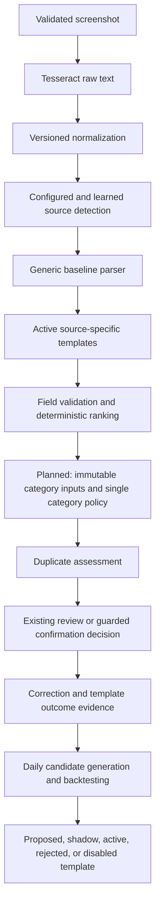
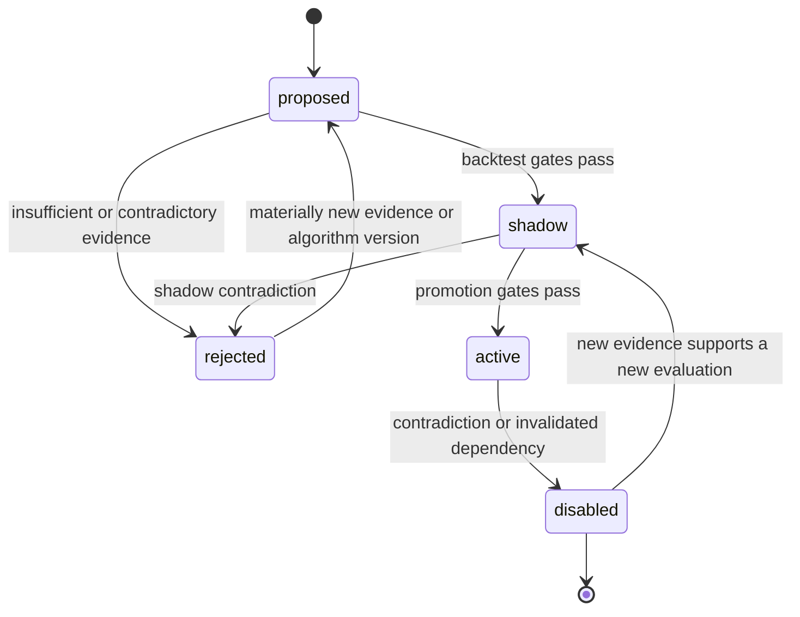

# Adaptive Finance OCR Learning and Source-Specific Parsing

- **Status:** Draft for approval
- **Owner:** Product and Engineering
- **Last updated:** 2026-09-18
- **Related documents:** [`PRD_007.md`](PRD_007.md), [`PRD_008.md`](PRD_008.md), [`PRD_009.md`](PRD_009.md), [`FINANCE_MODULE.md`](../FINANCE_MODULE.md)

## Summary

This PRD defines an adaptive, source-aware parsing system for Finance OCR. It turns reviewed Finance corrections into observable, versioned parser templates that are backtested and run in shadow mode before activation. The initial delivery improves source detection, reference number, merchant, transaction date, direction, payee, and notes parsing without automatically retraining or deploying a new OCR model.

The highest-ROI product work is source detection followed by source-specific field templates. Learning observability and guarded promotion are required foundations because they make every learned behavior measurable, explainable, reversible, and safe.

The next planned extension replaces legacy category learning with a guarded category classifier. Manual rules and qualified merchant/payee rules handle known cases, including payment-purpose phrases in reference notes. A configured LLM is the backup for unfamiliar or ambiguous notes; configured broad categories provide the final fallback. This extension is specified here but is not implemented by this documentation update. It does not retrain an LLM per transaction or change the completed algorithm 2/3 extraction contracts.

### Configurable reviewed rules follow-up

The reviewed TnG Card source signature, Ryt DuitNow QR merchant extraction, and Ryt merchant-icon cleanup are stored rule definitions, not hardcoded baseline parser branches. Generic `source_signature` and `guarded_merchant` algorithm 2 capabilities evaluate bounded literal conditions and extraction configuration in both runtime and SQL replay. Existing algorithm 2 definitions and algorithm 3 semantics remain unchanged.

An operator-only installer creates the three per-user/source proposals and replays reviewed evidence. It does not automatically activate them or fabricate supporting transactions. The normal cutoff, distinct-transaction support, contradiction tracking, fresh-shadow observations, operator promotion and automatic-disable gates apply. Automatic discovery of arbitrary compound conditions is not included. See the [guarded-rule rollout](../FINANCE_PARSER_LEARNING_ROLLOUT.md#configurable-guarded-receipt-rules-18-september-2026-not-deployed) for configuration semantics, deployment order and validation.

---

## Relationship to Existing Finance PRDs

This document enhances:

- [`PRD_007.md`](PRD_007.md), which defines the Screenshot-First Finance Tracking module, correction history, deterministic rules, and narrow scheduled learning.
- [`PRD_008.md`](PRD_008.md), which defines the Render-hosted Finance OCR service, Tesseract worker, image validation, parsing pipeline, and free-tier operating model.
- [`PRD_009.md`](PRD_009.md), which defines durable Android multi-file share processing and temporary image cleanup.

Those PRDs remain authoritative except where this document expands the Finance learning model to guarded source-specific parser templates and specifies the replacement category classifier in FR-020 through FR-025. That category replacement retires only legacy category learning, not manual rules or legacy reference-number transformations.

FR-020 through FR-025 supersede the earlier future-category proposal in the [rollout guide](../FINANCE_PARSER_LEARNING_ROLLOUT.md). The guide's recorded parser implementation and deployment status remains unchanged.

This PRD does not change:

- Finance authentication, authorization, or tenant ownership.
- The one-candidate-per-image contract.
- Existing duplicate detection and confirmation invariants.
- The current auto-confirmation threshold or safeguards.
- The default rule that original screenshots are not retained.
- The two-attempt limit for durable shared-image processing.
- The Render single-slot OCR capacity model.
- The free-tier Supabase and Render architecture. An explicitly enabled LLM backup has a separate approved provider, data-handling policy and spending cap; category classification must remain usable without it.

---

## Confirmed Product Decisions

| Topic | Decision |
| --- | --- |
| Primary objective | Improve Finance extraction from review corrections using deterministic, source-specific parser templates. |
| Highest-ROI scope | Source detection, then reference number, merchant, and transaction date extraction. |
| Learning visibility | Every scheduled learning run records corrections examined, candidates evaluated, templates activated, templates disabled, rejection reasons, precision, and coverage. |
| Learning input | Existing reviewed corrections, candidate payloads, normalized OCR text, source evidence, and original filenames. |
| Screenshot retention | No change. Production screenshots are not retained to support learning. |
| Initial layout model | Text-line-relative templates, not pixel-coordinate templates. |
| Activation | No candidate template affects production parsing until it passes historical backtesting and shadow evaluation. |
| Critical-field precision | Source, reference number, amount, and transaction date templates require perfect observed precision and zero known contradictions before activation in the initial release. |
| Minimum evidence | Three independent supporting transactions are required to propose promotion. More evidence may be required when enough historical cases exist. |
| Contradictions | A contradictory reviewed outcome prevents promotion or disables an active template at the next safe refresh. |
| Versioning | Templates and learning algorithms are versioned. A previous active version remains identifiable for rollback. |
| Auto-confirmation | Learned templates may improve candidate fields and confidence but do not relax existing automatic-confirmation safeguards. |
| Cron | Retain the existing daily Supabase learning schedule. Expand its business result recording instead of treating cron execution success as evidence of learning success. |
| OCR preprocessing | Benchmark as a later measured phase using explicit private fixtures. Do not deploy unmeasured transformations. |
| OCR model training | Offline and deferred until a sufficiently large consented labelled image set exists. Never retrain and deploy automatically from the daily cron job. |
| Delivery approval | Repository implementation and validation are separate from production migration and activation approval. |
| Category classification | A separate versioned classification rule family, not OCR extraction of category names. Start with exact normalized merchant or saved-payee identity and evidence-supported source/direction scopes. |
| Payee and reference notes | Learn payment-purpose phrases with payee context; do not assume every payment to one payee has the same category. |
| Category precedence | Manual category rules, qualified context-specific learned rules, eligible LLM backup, then configured generic fallback. More specific payee-and-note rules precede broader learned mappings; conflicting matches do not force a majority category. |
| Generic categories | Use stable user-configured broad categories from the existing active category catalog. Applying a default is not a learning event. |
| LLM role | Backup category inference only, after deterministic rules cannot resolve the case. No OCR correction, transaction confirmation, direct database writes or automatic rule activation. |
| Category evidence | Explicit user category choices/reviews are evidence; automatic acceptance, inherited predictions, fallback assignments and LLM guesses are not independent support. |
| Legacy category cutover | Remove the legacy category generator and assignment path when the validated replacement is released. No permanent dual category engine or legacy fallback. Preserve manual rules, reference transformations and historical evidence. |

---

## Evidence Snapshot

The following aggregate production evidence was measured on 2026-08-31. No OCR values, filenames, merchant names, references, or other private field contents were queried for this snapshot.

There were 86 accepted reviewed Finance candidates and 103 intakes with OCR text.

| Field | Initial review corrections | Missing prediction | Wrong non-empty prediction | Product implication |
| --- | ---: | ---: | ---: | --- |
| `category_id` | 77 | 77 | 0 | Categories are normally rule-driven; existing category learning remains useful but is not the first parser target. |
| `source_id` | 43 | 42 | 1 | Source detection is the highest-priority prerequisite for source-specific parsing. |
| `merchant` | 39 | 2 | 37 | The generic party fallback frequently selects the wrong text. |
| `reference_number` | 39 | 2 | 37 | The current four learned transforms do not represent the observed correction patterns. |
| `transaction_date` | 26 | 26 | 0 | Source-specific labels and formats should recover many missing dates. |
| `direction` | 13 | 5 | 8 | Source-specific debit and credit signals can improve direction. |
| `notes` | 12 | 6 | 6 | Lower priority after critical transaction fields. |
| `payee_name` | 12 | 10 | 2 | Lower priority, but compatible with the same anchored extraction engine. |
| `amount` | 2 | 2 | 0 | Amount parsing is already strong and does not justify immediate OCR retraining. |
| `recipient_reference` | 1 | 1 | 0 | Retain current behavior until more evidence exists. |

The existing daily learning job was active and successful at the time of measurement. Two learned category rules were active, while no learned reference rules were active. This shows that the scheduled learner runs, but its supported reference transformations are too narrow for the available evidence.

---

## Problem Statement

At the initial 2026-08-31 evidence snapshot, Finance recorded review corrections and ran a daily learning function, but most corrections could not influence future parsing. The limitations below explain the original parser work; completed repository phases and the planned category extension are distinguished in Delivery Phases.

The original learning system had four limitations:

1. Cron execution history shows whether the database function ran, not whether it produced useful learning outcomes.
2. Source detection depends on manually configured aliases and a narrow set of static signals.
3. Reference learning supports only prefix removal, suffix removal, digits-only conversion, and alphanumeric-only conversion.
4. Merchant, date, direction, payee, and note corrections do not create source-specific extraction behavior.

As a result, the user repeatedly corrects fields that contain enough contextual evidence to parse accurately, but the next similar screenshot often receives the same incorrect or missing value.

The problem is primarily parser adaptation, not raw OCR character recognition. Immediate Tesseract retraining would add significant data, privacy, testing, and deployment complexity while failing to address the strongest observed correction patterns.

---

## Goals

- Make every Finance learning run observable beyond cron execution status.
- Learn reliable source detection signals from confirmed source corrections.
- Learn source-specific text-line extraction templates for supported Finance fields.
- Backtest every candidate template against historical reviewed evidence.
- Run eligible templates in shadow mode before activation.
- Automatically prevent or disable templates when contradictory evidence appears.
- Record which template influenced each candidate field.
- Preserve existing review, duplicate, authorization, privacy, and auto-confirmation safeguards.
- Provide a safe Finance settings summary of learning status and outcomes.
- Remain within the current Supabase and Render free-tier architecture.
- Establish measured prerequisites for later image preprocessing and offline OCR training.
- Replace legacy category learning with observable merchant/payee-and-note classification, with manual-rule precedence and stable generic defaults.
- Use bounded, evaluated LLM backup inference for unfamiliar category context without requiring a model call for every transaction.

## Success Metrics

The first production evaluation window begins after source and field templates have been active for enough new reviewed screenshots to measure outcomes.

- Reduce missing `source_id` corrections by at least 50 percent from the evidence snapshot baseline.
- Reduce merchant corrections by at least 35 percent.
- Reduce reference-number corrections by at least 35 percent.
- Reduce missing transaction-date corrections by at least 35 percent.
- Maintain zero observed false corrections caused by active critical-field templates during initial rollout.
- Record a durable business outcome for 100 percent of scheduled learning runs.
- Make every active template traceable to supporting evidence, algorithm version, evaluation metrics, and activation time.
- Keep existing Finance security, duplicate, and automatic-confirmation contract tests passing.

Category-extension evaluation uses a separate explicitly reviewed, transaction-disjoint holdout and fresh shadow cohort. Report deterministic-rule accuracy, LLM-backup accuracy, wrong assignments, ambiguity, generic-fallback frequency, review corrections and coverage separately. Also measure provider call rate, latency, failures and cost. Compare against legacy category behavior and a generic-only baseline. Category-specific promotion and LLM enablement thresholds must be approved from those results before active rollout; model-reported confidence is not a substitute for observed correctness.

---

## Non-Goals

- Automatically training or deploying a Tesseract model from production corrections.
- Retaining production screenshots for learning or debugging.
- Pixel-coordinate or bounding-box template learning in the first delivery.
- LLM-based OCR correction, autonomous transaction review or confirmation. Bounded category-only backup inference is in scope under FR-023.
- Cross-user or global template sharing.
- Relaxing source ownership or applying one user's correction evidence to another user.
- Automatically changing existing user-created manual rules.
- Automatically confirming a transaction solely because a learned parser template matched.
- Changing duplicate detection semantics.
- Replacing the existing generic parser. It remains the fallback and comparison baseline.
- Requiring paid OCR, storage, training or observability services. LLM backup may use an explicitly approved provider budget; selecting or paying for a provider is not authorized by this PRD alone.
- Fine-tuning or retraining an LLM automatically from each receipt or correction.
- Guaranteeing extraction for every bank, e-wallet, receipt, or screenshot layout.

---

## Users and Access

| User or role | Allowed actions |
| --- | --- |
| Authenticated Finance user | Benefit from their own active templates and view safe aggregate learning status for their account. |
| Authenticated Finance user | Continue reviewing and correcting their own Finance candidates through the existing review workflow. |
| Finance server runtime | Read user-scoped active templates and record template application evidence. |
| Supabase scheduled database role | Generate, evaluate, move eligible proposals to shadow, disable and summarize learned rules through the reviewed scheduled function; no external model calls or automatic activation. |
| Trusted database operator | Promote eligible parser or category rules and perform the approved category cutover through restricted audited helpers. |
| Anonymous user | No access. |
| Another authenticated user | No access to another user's templates, evidence, corrections, OCR text, or learning metrics. |

---

## Runtime Ownership

### Next.js Application

- Continue owning Finance authorization and review workflows.
- Return safe user-scoped learning summaries through the existing Finance server boundary.
- Display learning status in Finance settings without exposing raw correction or OCR content.
- Preserve current request-security and mutation behavior.
- Capture explicit category-review intent and expose active generic-category configuration through the existing authorized Finance boundary.
- On retries, invoke the same category decision policy and server-only LLM adapter used by the OCR service, after field extraction.

### Render Finance OCR Service

- Load active user-scoped source and field templates with the existing Finance parsing context.
- Apply templates deterministically after baseline normalization and before final candidate confidence calculation.
- Record matched template identifiers in the candidate payload or reviewed persistence contract.
- Preserve one OCR slot, existing image limits, safe logging, and worker lifecycle behavior.
- Never log template evidence values, OCR text, filenames, or private Finance fields.
- After generalized extraction, run category shadow evaluation or the released category decision policy. Use bounded server-side LLM backup only when allowed, without occupying the Tesseract worker during the provider request or increasing OCR slots.

### Shared Finance OCR Library

- Own pure source-template matching, anchored field extraction, validation, ranking, and deterministic conflict handling.
- Remain independent of React, browser APIs, Next.js runtime APIs, and credentials.
- Keep the generic parser as a fallback when no active template yields a valid field.
- Own pure category input normalization, deterministic matching, precedence and output validation. Keep asynchronous provider calls and credentials outside the pure parser/evaluator.

### Supabase Postgres and Cron

- Persist learning runs, parser templates, evidence links, metrics, lifecycle state, and algorithm versions.
- Generate and evaluate candidates from reviewed user-owned evidence.
- Enforce tenant ownership, constraints, indexes, RLS, grants, and cron-only mutation boundaries.
- Run the daily learning refresh within a short bounded transaction.
- Retain sufficient learning history for diagnosis while pruning obsolete operational run detail according to an explicit retention policy.
- Reuse the learning-run transaction, invocation idempotency and summaries for category rules and reviewed evidence. Replay deterministic category rules in SQL; do not call an LLM from Cron or a database transaction.

---

## Functional Requirements

### FR-001 Learning Run Observability

Every invocation of the Finance learning refresh must create one durable learning-run record.

The run must record:

- algorithm version
- start and finish timestamps
- terminal status
- corrections examined
- candidate templates created
- existing candidates updated
- candidates promoted to shadow
- templates activated
- templates disabled
- candidates rejected
- bounded rejection reason counts
- safe failure stage and error code when unsuccessful

The record must not contain OCR text, filenames, field values, tokens, access credentials, or unbounded provider or database error messages.

### FR-002 Idempotent Daily Refresh

Re-running the learning function over unchanged evidence must not create duplicate runs for the same invocation, duplicate evidence links, duplicate template versions, or oscillating template state.

A failed run must leave previously active templates unchanged unless the relevant disable decision was committed atomically before the failure.

### FR-003 Source Detection Candidate Generation

Confirmed `source_id` corrections must be eligible to create source-detection candidates from:

- normalized filename tokens
- normalized OCR line tokens
- repeated source or application names
- repeated header and footer phrases
- stable transaction labels
- existing user-configured source aliases

Candidate generation must exclude or mask unstable values including:

- amounts
- balances
- dates and times
- transaction and reference identifiers
- long digit sequences
- user-entered notes
- low-frequency free-form party values

Source candidates must remain user-owned and source-specific.

### FR-004 Source Detection Bootstrapping

Source templates must be evaluated before field templates because field templates require a source scope.

At runtime, source resolution order is:

1. Strong unambiguous filename or configured source alias.
2. Active learned source template.
3. Existing generic OCR source aliases.
4. Existing compatible manual rule behavior.
5. Unresolved source, requiring review.

Conflicting strong source signals must leave the source unresolved. A learned template must not override a different unambiguous configured filename signal.

### FR-005 Field Template Candidate Generation

Predicted and corrected field pairs may generate field-template candidates for:

- `reference_number`
- `merchant`
- `transaction_date`
- `direction`
- `payee_name`
- `notes`
- `recipient_reference`
- `amount`, only when evidence supports a safe deterministic pattern

Category classification is a separate rule family under FR-020 through FR-025, not an additional extracted field or algorithm 3 template type. Existing category behavior remains in place only until the approved replacement release.

### FR-006 Initial Template Types

The first delivery supports bounded deterministic templates:

- same-line label capture
- next non-empty line after label
- bounded line-window capture
- validated regular-expression capture
- source-specific prefix removal
- source-specific suffix removal
- context-aware character filtering
- explicit date-format conversion
- explicit numeric separator normalization
- source-specific direction phrase mapping
- canonical saved-payee matching after extraction

Arbitrary executable patterns, user-provided regular expressions, dynamic SQL, and generated code are forbidden.

Implementation update (7 September 2026): algorithm 3 completes non-amount bounded line windows, allowlisted regex captures, prefix/suffix removal, character filtering and explicit date formats across runtime extraction, correction-based generation, SQL replay and evidence. Algorithm 2 behavior and evidence remain unchanged. Numeric separators and every amount-template variant remain deferred under the evidence gate, so this does not claim complete FR-006 amount support or measured production accuracy gains. See [algorithm 3 rollout and validation](../FINANCE_PARSER_LEARNING_ROLLOUT.md#algorithm-3-non-amount-completion-7-september-2026).

Reference transforms use only the recorded pre-template baseline, captured after manual and legacy rules on each new parse/retry. Missing historical baseline context is unresolved, not reconstructed from corrected values or current rules. Both algorithm versions share runtime limits and promotion overlap checks. Compatible application and OCR runtimes must deploy before the new migration may generate algorithm 3 templates; production migration and activation remain separate approvals.

### FR-007 Template Definition

Every parser template must include:

- user ID
- optional source ID, required for field templates
- field name
- template type
- bounded validated configuration
- algorithm version
- template version
- evidence count
- contradiction count
- evaluation count
- precision estimate
- coverage estimate
- lifecycle status
- creation, evaluation, activation, disable, and update timestamps where applicable
- optional predecessor template ID
- bounded disable or rejection reason

### FR-008 Historical Backtesting

Each candidate template must be replayed against applicable historical reviewed evidence for the same user and source.

Backtesting must classify each reviewed item as:

- supported
- contradicted
- not applicable
- invalid output
- unresolved because required context is missing

Backtesting must not mutate historical candidates, transactions, corrections, or OCR text.

### FR-009 Shadow Mode

A candidate that passes historical backtesting enters shadow mode before activation.

In shadow mode:

- the template runs during new OCR parsing
- the baseline parser result remains authoritative
- the template result is recorded as a bounded evaluation outcome
- no transaction candidate field is changed by the shadow result
- later review determines whether the shadow result would have been correct

### FR-010 Promotion Gates

Initial promotion requires:

- at least three independent supporting confirmed transactions
- at least five evaluated historical or shadow cases when five applicable cases exist
- zero known contradictions
- valid source ownership and active source state
- valid output under existing Finance field validation
- perfect observed precision for source, reference number, amount, and transaction date
- no ambiguity with another active template of equal or higher rank
- a recorded algorithm and template version

Promotion thresholds may become stricter through a later reviewed migration. They must not become weaker through an environment variable or unreviewed runtime configuration.

### FR-011 Runtime Template Application

At runtime:

1. Tesseract returns raw OCR text.
2. The existing normalizer produces versioned normalized text.
3. Existing and learned source signals resolve the source when unambiguous.
4. The generic parser creates the baseline payload.
5. Active source-specific templates propose field values.
6. Field validators reject invalid template output.
7. Deterministic ranking resolves multiple valid template proposals.
8. Accepted template IDs and safe evaluation metadata are attached to the candidate.
9. The planned category extension evaluates the resulting merchant/payee/source/direction and notes, records its own input snapshot, and applies FR-021 only after the replacement release. Before release, its shadow result cannot change the existing category.
10. Existing duplicate assessment and finalization continue unchanged.

A template that fails or produces invalid output must fall back to the baseline parser for that field without failing the complete OCR request.

### FR-012 Template Ranking and Conflicts

Template ranking must be stable and deterministic.

Ranking considers:

1. active status
2. exact source match
3. observed precision
4. evidence count
5. narrower anchor and capture scope
6. algorithm version
7. activation time
8. stable template ID ordering

Two equally ranked templates that produce different values leave the field at its baseline value and record a safe conflict outcome.

### FR-013 Contradiction and Automatic Disable

When a reviewed correction contradicts an active template result:

- link the correction as contradiction evidence
- do not rewrite the historical template version
- mark the template for reevaluation
- disable it during the next safe refresh if it no longer meets promotion gates
- retain its metrics and predecessor relationship for diagnosis
- fall back to the baseline parser or a separately eligible prior version

The daily job must never delete correction evidence to make a template eligible.

### FR-014 Existing Auto-Confirmation Safeguards

Template application does not independently qualify a candidate for auto-confirmation.

All current requirements remain necessary, including confidence, required fields, rule strength, source resolution, duplicate outcome, transaction validity, and current direct-versus-queued intake policy.

An LLM category prediction or generic fallback must not be treated as a strong manual-rule match, increase OCR confidence, or independently qualify a candidate for automatic confirmation.

### FR-015 Finance Settings Summary

Finance settings must show a concise user-scoped learning area containing:

- last completed run and status
- corrections examined in the last run
- active learned source templates
- active learned field templates
- shadow candidates
- candidates gathering more evidence
- recently rejected or disabled candidates with safe reasons
- precision and coverage for active templates
- category rule states, explicitly reviewed support, wrong assignments, conflicts and coverage
- category assignment counts by manual rule, learned rule, LLM backup and generic fallback, plus safe provider availability, latency and budget outcomes

Raw OCR text, raw filenames, reference values, transaction values, and correction payloads must not appear in the settings summary.

### FR-016 Cron Operation

The existing `finance-rule-learning` schedule remains the learning trigger.

The scheduled function must:

- use a bounded statement timeout
- avoid external network calls
- keep transactions short
- process the current evidence volume comfortably within the Supabase Cron duration guidance
- use supported `cron.schedule` and `cron.alter_job` functions rather than direct writes to `cron.job`
- record its business outcome independently from `cron.job_run_details`

### FR-017 Learning Run Retention

Learning business records require an explicit retention policy.

- Active template definitions and supporting evidence links remain while the template or referenced Finance history remains relevant.
- Detailed learning-run records remain for at least 90 days.
- Aggregate active-template metrics remain durable.
- Cron execution history may be pruned independently because it is operational history, not authoritative business learning evidence.
- Retention must never remove evidence required to explain an active template.

### FR-018 Image Preprocessing Benchmark

After the adaptive parser delivery, an offline benchmark may evaluate:

- conservative upscaling
- grayscale conversion
- contrast normalization
- conservative thresholding
- supported Tesseract segmentation modes
- multiple OCR variants ranked by existing field validation

The benchmark requires an explicit private fixture set. Production screenshot retention must not change.

No preprocessing variant ships unless it improves the agreed fixture metrics without unacceptable regression, memory use, latency, or image-validation risk.

### FR-019 Offline OCR Model Training Gate

Custom OCR model training remains deferred until all of the following are available:

- explicit consented labelled image or field-crop fixtures
- sufficient examples for each targeted source and layout
- separate training, validation, and untouched test partitions
- a reproducible offline training process
- a versioned model artifact
- benchmark evidence that it outperforms the current model
- a reviewed deployment and rollback procedure

The daily production cron job must never train, select, or deploy OCR model artifacts.

### FR-020 Guarded Category Rules and Purpose Matching (Planned)

Category rules map a normalized merchant key or canonical saved-payee ID to an existing user-owned active category. They may be narrowed by source and expense/income direction. Start with narrow scopes; a broader rule must be evaluated across all eligible reviewed cases in its proposed scope. The target category's type must be compatible with the transaction direction even when direction is not an explicit rule condition.

Payee rules may additionally match bounded normalized payment-purpose words or phrases from notes and the recipient-reference text already merged into notes. For example, the same payee with a reviewed rent-related phrase may map to Housing, while a reviewed meal-related phrase maps to Dining. Recognize stable purpose context, not unique reference numbers, account identifiers, dates, amounts or the entire private note. Do not invent a category or learn an unconditional payee mapping from evidence that depends on a particular purpose phrase.

Use literal/token-based, versioned matching with bounded configurations. Arbitrary regex, generated code and executable model output remain forbidden. Competing categories for the same context are ambiguity evidence, not permission to select the most frequent category. Missing or unfamiliar note context must not be forced through a broader payee rule known to be ambiguous.

Rules reuse immutable versions, proposed/shadow/active/rejected/disabled states, explicit upload cutoffs, independent-transaction support, historical replay, fresh shadow evidence, operator promotion and automatic disable. Use the current three-support, five-evaluation-when-applicable and three-fresh-shadow safeguards as minimum development floors, with zero known contradictions and initially perfect observed precision. Review category-specific thresholds against held-out and fresh-shadow outcomes before enabling production promotion. No automatic activation is introduced.

### FR-021 Category Decision Policy and Generic Defaults (Planned)

After field extraction, one category decision function applies this precedence:

1. A matching user-created manual category rule, unconditionally ahead of learned rules regardless of their priority score.
2. A qualified active payee-and-purpose rule, then an unambiguous qualified merchant/payee rule. Use deterministic semantic ranking; stable IDs must not resolve equal-rank category disagreement.
3. The configured and evaluation-approved LLM backup when rules cannot resolve unfamiliar or ambiguous context.
4. A configured broad merchant/payee default when applicable, otherwise the user's generic category for that expense/income direction.

Generic defaults are explicit configuration, not inferred category hierarchy or majority-vote learning. They reference existing active categories owned by the user and compatible with direction. Require valid generic defaults for both directions before replacement cutover. A missing, deleted, archived or incompatible default must produce a safe review-required outcome, never an invented or another user's category.

Do not create learning evidence or repeatedly generate a rule merely because a generic default was applied. Only explicit reviewed choices can teach exceptions. Record assignment origin and rule/configuration version so defaults, LLM proposals and learned decisions remain distinguishable. Never recategorize already confirmed historical transactions during learning or cutover.

### FR-022 Explicit Review Evidence and Replay Inputs (Planned)

Record whether the user explicitly chose or reviewed the category, including an unchanged prefilled choice. A general manual confirmation or an automatically confirmed transaction alone does not prove category review. Historical changed-category corrections may be used conservatively where human origin is verifiable; unknown-origin records cannot become supporting evidence. Never infer human review merely from accepted/confirmed status.

Persist an immutable per-parse-attempt category input snapshot after field templates and before category assignment: normalized merchant or saved-payee identity, source, direction, bounded necessary note context, existing category provenance and relevant parsing/policy versions. This is separate from the pre-template reference baseline. Link observations, explicit category reviews and latest effective corrections to the same user, intake, candidate and confirmed transaction. Repeated reviews, retries or model calls cannot count as extra independent transactions.

Generate rules only from eligible explicit reviews of confirmed transactions within the upload cutoff. Replay every eligible case in the proposed scope, including contradictions, invalid output, non-applicability and unresolved context, not only supporting examples. Use the recorded parse-time inputs, never today's parser or user-corrected merchant/payee inputs as substitute predictions. Missing historical context remains unresolved. Apply the same pure matching semantics in TypeScript and SQL.

Shadow observations retain rule/model version, observed time, proposed category, outcome and bounded provenance without changing the saved category. Promotion requires fresh explicit reviews after the current shadow period began. Archived dependencies, contradictory review evidence or lost support prevent promotion or disable an active rule through the reviewed lifecycle.

### FR-023 LLM Backup Classification (Planned)

Provide a server-only provider adapter for category inference, not an autonomous agent. A model call is eligible only after manual and qualified deterministic rules fail to resolve the context. Avoid calls for known matches. The adapter remains disabled until provider/model selection, privacy/retention settings, evaluation results, timeout and spending limits are approved. Missing configuration, unavailable service or exhausted budget must use FR-021's generic fallback without failing OCR or review.

Send only minimized relevant context: a bounded reference note with unnecessary identifiers removed, necessary merchant/payee context, direction, the user's allowed category IDs and brief meanings, and a bounded set of relevant explicitly reviewed examples. Exclude screenshots, full OCR text, filenames, account/reference identifiers and unrelated transaction history. If safe minimization removes necessary meaning, use the generic fallback. Provider data handling requires explicit approval; credentials never reach the browser, logs or model prompt. No cross-user examples or caches.

Require structured output containing one allowed category ID or an explicit uncertain outcome. Validate the output schema, tenant ownership, category activity and direction compatibility on the server. Treat note text and examples as untrusted data, not instructions. The model has no tools, database access, permission to create categories, or authority to confirm a transaction, edit rules or activate learning. Schema validity and self-reported confidence do not establish semantic correctness.

Use a bounded request deadline, input/output token caps, concurrency limit and per-user/global call and cost budgets. Do not retry indefinitely, prolong an OCR lease beyond its deadline or spend another OCR processing attempt solely for category inference. Timeout, refusal, malformed output, invalid category and uncertainty all fall back safely. Cache or deduplicate only within the same user and exact effective context, including category catalog, reviewed-example, model, prompt and policy versions; never reuse a stale result after review or configuration changes.

Record model/prompt/schema versions, context identity, selected-category-or-uncertain outcome and bounded operational metrics in private observations. Reuse the recorded validated outcome for historical evaluation rather than recalling a live model and presenting it as deterministic SQL replay. Evaluate on held-out explicit reviews and fresh shadow cases before active use; exclude the evaluated transaction's review and other held-out labels from prompt examples and rule development. Provider/model/prompt changes require reevaluation. LLM predictions do not validate themselves or activate a learned phrase rule. Learning means retaining explicit corrections, selecting reviewed examples and qualifying reusable deterministic rules, not retraining the LLM for each transaction.

### FR-024 Legacy Category Replacement (Planned)

Validate the replacement using historical replay and shadow observations before release. The existing system may serve categories during that preparation period, but the replacement release must remove the legacy category generation and runtime assignment paths rather than maintain a selectable second category engine.

At the approved cutover, stop the legacy category-generation portion of the scheduled learner, retire its automatically generated category rules from runtime use, remove legacy-only application queries/branches and route all new category assignments through FR-021. Preserve manual rules, already assigned transaction categories, corrections and audit evidence. Retain retired rule records for historical explanation, not as an active fallback. Remove category-only legacy helpers when no retained dependency requires them.

Split shared legacy responsibilities as needed so reference-number transformations continue unchanged and the existing Cron schedule, invocation idempotency, integer return contract, durable outcomes and retention remain compatible. Do not remove legacy reference learning, the generic field parser or algorithm 2/3 templates as part of this category replacement. Apply database changes only through forward migrations.

If qualified category rules are still gathering shadow evidence at release, manual rules and configured generic defaults provide working categorization. LLM backup is used only if separately enabled and qualified. Runtime failure falls back within the new system, not to legacy category learning. Release and rollback must never run two independent category writers.

### FR-025 Category Observability and Release Gates (Planned)

Extend Rules settings and per-user learning summaries with category lifecycle counts, independently reviewed support, precision, coverage, false assignments, ambiguity, fallback frequency and bounded rejection/disable reasons. Report LLM and deterministic-rule outcomes separately, including provider-disabled, timeout and budget-exhausted outcomes. Do not expose note text, prompts, raw provider responses or correction payloads in summaries or logs.

Version the category policy and fallback configuration independently from the extraction algorithms. Before active rollout, compare the new policy with legacy categorization and generic-only defaults on explicitly reviewed holdouts and fresh observations. Approve category thresholds, provider privacy/cost settings and the legacy-removal release separately. This PRD records the product design, not provider procurement, production deployment, migration application or demonstrated accuracy improvements.

---

## How Source-Specific Templates Work

### Source Learning Example

1. A screenshot reaches review with no detected source.
2. The user confirms the correct source.
3. The correction is linked to the intake's normalized filename and OCR text.
4. The learner extracts stable, non-sensitive candidate signals and removes volatile transaction values.
5. Repeated occurrences for the same source increase support.
6. Occurrences tied to a different confirmed source create contradiction evidence.
7. A sufficiently precise candidate enters shadow mode.
8. New OCR requests evaluate the shadow template without changing the candidate.
9. Confirmed shadow outcomes allow activation.

### Field Learning Example

1. The source is resolved.
2. The baseline parser proposes an incorrect reference number.
3. Review supplies the correct reference number.
4. The learner searches the original normalized OCR lines for the corrected value or a safe normalized representation.
5. It identifies a repeatable anchor and bounded value relationship, such as the next non-empty line after a source-specific label.
6. A template candidate is created for that user, source, and field.
7. Historical reviewed screenshots are replayed.
8. Supported outcomes increase evidence; mismatches create contradictions.
9. The template enters shadow mode and later activates only after all gates pass.

### Runtime Flow

---

## Template Lifecycle

Lifecycle transitions must be idempotent, audited, and constrained. A template version cannot return directly from `disabled` to `active` without a new shadow evaluation.

---

## Logical Data Model

Final names may change during migration review, but responsibilities and security boundaries are required.

### `finance_learning_runs`

Purpose: authoritative business result for each learning refresh.

Required fields:

- `id uuid primary key`
- `algorithm_version integer`
- `status text`
- `started_at timestamptz`
- `finished_at timestamptz`
- bounded integer count columns for examined, proposed, shadowed, activated, disabled, and rejected outcomes
- bounded JSON summary only for enumerated reason counts when typed columns would be excessively sparse
- safe `failure_stage` and `failure_code`
- optional cron job run identifier when safely available

The table contains no user correction values. Per-user outcomes belong in a separate user-scoped summary or are derived from template state without exposing other users.

### `finance_parser_templates`

Purpose: versioned source-detection and field-extraction templates.

Required fields:

- `id uuid primary key`
- `user_id uuid not null`
- `source_id uuid null` for source detection, required for field extraction
- `field_name text not null`
- `template_type text not null`
- bounded `configuration jsonb not null`
- `algorithm_version integer not null`
- `template_version integer not null`
- `status text not null`
- `evidence_count integer not null`
- `contradiction_count integer not null`
- `evaluation_count integer not null`
- `precision numeric`
- `coverage numeric`
- `predecessor_template_id uuid null`
- `created_at`, `evaluated_at`, `activated_at`, `disabled_at`, and `updated_at` as `timestamptz`
- bounded `status_reason text null`

Required constraints:

- valid lifecycle status
- valid field and template type combinations
- non-negative counts
- precision and coverage between zero and one
- source ownership through a tenant-safe composite foreign key
- unique version identity for a logical template
- configuration size and shape validation at the database and application boundaries

Recommended indexes:

- `(user_id, status, field_name)`
- `(user_id, source_id, field_name, status)`
- partial active-template lookup index
- partial shadow-template lookup index
- predecessor foreign-key index

### `finance_template_evidence`

Purpose: traceable support, contradiction, and shadow evaluation links.

Required fields:

- `id uuid primary key`
- `template_id uuid not null`
- `user_id uuid not null`
- `correction_id uuid null`
- `candidate_id uuid null`
- `intake_item_id uuid null`
- `outcome text not null`
- `algorithm_version integer not null`
- `created_at timestamptz not null`

Required behavior:

- At least one reviewed evidence reference is required.
- Ownership must match across every linked Finance record.
- The same evidence and template version pair is unique.
- Evidence rows store relationships and bounded outcomes, not duplicated OCR or correction payloads.
- Foreign-key columns used in joins require indexes.

### Planned Category Records

FR-020 through FR-025 require separate classification records rather than adding category names to parser field templates. Final table names and bounded configuration limits require implementation review:

- Versioned user-owned category rules: normalized merchant key or saved-payee identity, optional purpose phrases, source/direction scope, target category, lifecycle, cutoff, predecessor, independent support, contradictions and evaluation metrics.
- Immutable category observations per parse attempt: protected minimal classification inputs, assignment origin, rule/policy/default versions, shadow predictions and outcomes. LLM observations additionally identify model/prompt/schema versions and bounded latency, usage and failure metrics. Do not duplicate full OCR text or retain raw provider responses.
- Explicit category reviews and evidence: human-review intent, reviewed category and tenant-safe links to the observation, latest effective correction, candidate, intake and confirmed transaction. Enforce uniqueness per rule version and reviewed transaction so retries cannot inflate support.
- User-configured generic defaults: owned active categories compatible with expense/income direction, with optional broad merchant/payee defaults and immutable configuration provenance. Default assignments are not supporting evidence.

Enforce tenant-safe ownership for category, payee, source and evidence relationships, valid lifecycle transitions, bounded configurations, metric ranges and version identities. Index tenant/scoped active and shadow lookups, review/cutoff scans and all joining foreign keys. Apply server-only access and explicit grants; do not expose raw observations in Rules settings. Define private input retention and deletion behavior before rollout, separately from the 90-day detailed-run retention. Evidence loss must trigger reevaluation, not silent continued qualification.

### Existing Records

Existing tables remain authoritative:

- `finance_corrections` stores previous and corrected reviewed values.
- `finance_intake_items` stores retained raw and normalized OCR text, filename, hashes, source evidence, and processing versions.
- `finance_candidate_transactions` stores baseline and applied parsing outcomes.
- `finance_rules` continues owning manual category rules. Legacy learned category rules remain in use only until the FR-024 replacement release, then become retired audit records rather than runtime inputs.
- `finance_field_learning_rules` remains compatible during migration and may be absorbed into the generalized template model only through an explicit forward migration with preserved evidence and behavior.

---

## Security and Privacy

- All templates and evidence are user-owned.
- New exposed-schema tables require RLS, explicit grants, and reviewed policies or restrictive browser denial matching the server-only model.
- Service-role or secret-key access remains server-only.
- Cron-only mutation functions use `security invoker` where possible, a fixed empty `search_path`, explicit schema qualification, and revoked execution for browser roles.
- No function becomes `security definer` merely to bypass a permission problem.
- Browser summaries are returned through an authorized Finance server operation and contain no raw OCR or correction payloads.
- Template configuration is bounded and validated before persistence and execution.
- Dynamic SQL, arbitrary code, and user-authored executable patterns are prohibited.
- Raw OCR text, filenames, transaction values, references, access tokens, secret keys, and screenshot paths remain excluded from logs.
- No screenshots are retained or copied into learning tables.
- Cross-user evidence aggregation is forbidden even when two users share the same source name.
- Category note context and explicit reviews remain protected Finance data. Only FR-023's minimized context may leave the server for an explicitly approved provider; do not send full OCR, screenshots or raw evidence tables.
- Validate model output against the requesting user's current category catalog. Prompt injection, another user's category ID or stale/deleted categories must not bypass validation.
- Review provider retention, deletion and data-use settings before enabling LLM calls. Local observations and caches require explicit retention, tenant isolation and invalidation policies; no raw prompts or responses in logs.

---

## Reliability and Performance

- Daily learning must be safe to retry.
- Candidate generation and evaluation must use deterministic ordering.
- Long historical scans must use indexed user, field, source, status, and created-time access paths.
- The cron transaction must remain short and avoid external calls.
- Large evaluation work may be divided across bounded daily runs using a durable watermark, without skipping corrections.
- Existing active templates remain usable if a new learning run fails.
- Template loading occurs with the existing parallel Finance context request and must not introduce per-template database queries.
- Runtime parsing remains pure and bounded by configured maximum template counts per user, source, and field.
- Template conflicts fall back to the baseline parser rather than failing OCR.
- Query plans for candidate generation, active-template loading, shadow evaluation, and settings summaries must be checked before rollout.
- Keep the pure classifier separate from bounded asynchronous provider calls. Category inference must respect the remaining processing deadline and fall back without consuming another OCR attempt solely for inference.
- Daily category learning and deterministic replay make no external model calls. Evaluate historical LLM observations from recorded versioned outputs, with live model evaluation treated as a separate approved activity.
- Enforce category rule-count and candidate/evaluation caps, per-user/global provider budgets and concurrency limits before release. The application remains functional with LLM backup disabled.

---

## Failure and Edge Cases

| Scenario | Expected behavior |
| --- | --- |
| Learning cron runs successfully but finds no eligible template | Record a successful run with zero promotions and bounded rejection or insufficient-evidence counts. |
| Learning run fails | Record a safe failed run when possible; preserve current active templates. |
| Evidence supports two sources | Reject or leave the source unresolved. |
| Two active templates produce different field values | Keep the baseline field and record a safe conflict outcome. |
| Template output fails field validation | Ignore the template for that field and retain the baseline value. |
| Source is archived | Do not promote or apply its templates to new transactions. |
| Correction contradicts an active template | Record contradiction evidence and disable the template during the next safe reevaluation. |
| Correction history is later removed with its transaction | Recalculate dependent evidence and disable templates that no longer meet gates. |
| Shadow template has no later reviewed outcome | Keep it in shadow until sufficient evidence exists. |
| Template algorithm changes | Create a new version and re-run backtesting; do not mutate the old version's meaning. |
| Render cannot load templates | Process with the existing baseline parser and safe persistence behavior. |
| Settings summary cannot load | Show a safe unavailable state without affecting OCR or review. |
| A preprocessing experiment regresses latency or accuracy | Do not deploy it. |
| A payee has several legitimate categories | Use qualified purpose-specific rules; unresolved ambiguity proceeds to the approved LLM backup or configured generic default. |
| LLM backup is disabled, unavailable, uncertain, malformed or over budget | Apply the generic fallback without failing OCR, bypassing review or invoking the legacy category engine. |
| A category or generic default becomes invalid | Exclude invalid rules/results and request review if no valid configured fallback exists. Never invent a category. |
| A category is accepted without explicit category review | Preserve its assignment provenance, but do not count it as independent category-learning support. |
| A historical category input snapshot is missing | Record unresolved context; do not reconstruct a prediction from today's parser or corrected party fields. |

---

## ROI and Delivery Priority

| Workstream | Direct accuracy impact | Relative effort | ROI | Delivery decision |
| --- | --- | --- | --- | --- |
| Learning observability | Indirect but required | Low | Very high operational ROI | Build first. |
| Source detection templates | Very high | Medium | Highest product ROI | First accuracy delivery. |
| Reference, merchant, and date templates | Very high | Medium | Highest product ROI | Build immediately after source detection. |
| Shadow evaluation and rollback | Indirect but required | Medium | High safety ROI | Required before activation. |
| Direction, payee, and notes templates | Medium | Medium | Medium to high | Add after critical fields. |
| Image preprocessing | Unknown to medium | Medium | Unproven | Benchmark separately. |
| Custom OCR model training | Uncertain | Very high | Lowest currently | Defer. |
| Guarded category replacement | Classification impact to be measured | Medium to high | Requires held-out comparison | Planned extension, independent of OCR model training. |
| LLM category backup | Potential benefit on unfamiliar purpose text | Additional privacy, cost and latency | Must outperform generic-only fallback | Optional, gated and only after deterministic rules cannot resolve a case. |

The recommended first approved delivery includes observability, source detection templates, critical field templates, historical backtesting, shadow mode, promotion, contradiction handling, and rollback.

---

## Delivery Phases

### Phase 0: Contract and Baseline

- Freeze the evidence snapshot and success metrics in tests or reviewed documentation.
- Define template types, lifecycle states, ranking, metrics, and privacy limits.
- Add representative pure parser fixtures for current baseline behavior.
- Confirm the existing cron, migration history, and production function owner.

### Phase 1: Observable Learning

- Add a new forward migration for learning runs, parser templates, evidence, constraints, indexes, grants, and RLS.
- Expand the daily learning function to record business outcomes.
- Add safe server repository methods and Finance settings summaries.
- Preserve existing category and reference learning behavior during the compatibility period.

### Phase 2: Source Detection Templates

- Add bounded source candidate generation.
- Add historical source backtesting.
- Add source shadow evaluation.
- Integrate active source templates into the shared parser.
- Record matched source-template evidence.

### Phase 3: Critical Field Templates

- Add reference-number templates.
- Add merchant templates.
- Add transaction-date templates.
- Add deterministic validation, ranking, and conflict fallback.
- Add field-level template traceability to candidate persistence.

### Phase 4: Remaining Field Templates

Repository implementation completed on 2026-09-06. Amount templates remain conditional on new evidence. See [implementation and rollout status](../FINANCE_PARSER_LEARNING_ROLLOUT.md).

- Add direction phrase mappings.
- Add payee extraction and canonical matching templates.
- Add bounded notes and recipient-reference templates.
- Evaluate amount templates only if new correction evidence justifies them.

### Phase 5: Guarded Activation

Repository implementation completed on 2026-09-06 with isolated lifecycle and replay verification. Production migration, shadow observation, and activation remain subject to Gates C and D. See [implementation and rollout status](../FINANCE_PARSER_LEARNING_ROLLOUT.md).

- Backfill candidate evaluations without mutating historical Finance records.
- Run all candidates in shadow mode.
- Review metrics and contradictions.
- Activate only templates meeting the promotion gates.
- Verify automatic disable and rollback behavior.

### Phase 6: Preprocessing Experiment

- Assemble explicit private fixtures without changing production screenshot retention.
- Benchmark safe Sharp and Tesseract configurations.
- Measure field accuracy, OCR latency, memory, and failure rate.
- Propose a separate reviewed production change only if the benchmark shows material net benefit.

### Phase 7: Offline Model Readiness

- Define consent, labelling, partitioning, training, benchmark, artifact, and rollback requirements.
- Do not begin production model training until the data gate and a separate approval are satisfied.

### Phase 8: Guarded Category Replacement and LLM Backup (Planned)

This is the next proposed category workstream, not implemented by this document update. It does not depend on completing the optional preprocessing or custom OCR model experiments in Phases 6 and 7.

1. Define the separate versioned classifier, purpose matching, generic defaults, explicit review intent and immutable post-extraction input contract.
2. Add tenant-safe rule, observation and review evidence persistence through forward migrations. Integrate bounded deterministic learning/replay into existing run tracking without changing reference learning or Cron compatibility.
3. Implement the shared category decision policy after field extraction in both OCR intake and application retry paths. Add the optional server-only LLM adapter, with mocked validation, privacy, timeout, budget and cache tests before enabling any provider.
4. Gather historical and fresh shadow evidence without changing saved categories. Compare deterministic rules, the proposed LLM backup, legacy categorization and generic-only defaults using explicitly reviewed holdouts. Approve category-specific gates and provider settings separately.
5. Release one category path with configured generic defaults. Remove legacy category generation and runtime assignment code, retire legacy generated category rules and preserve manual rules, history and reference-number learning.
6. Promote only qualified category rules through operator review. Observe false assignments, fallback frequency and provider cost/latency; disable unsupported rules or LLM backup while keeping the new manual/default path available.

---

## Deployment and Rollback

### First Delivery Deployment Order

1. Add database structures, constraints, indexes, grants, RLS, and compatibility behavior through a new forward migration.
2. Deploy application and OCR service code that can read the new structures while all templates remain non-active.
3. Run historical backtesting.
4. Review learning-run outcomes and security or performance advisors.
5. Enable shadow evaluation only.
6. Observe reviewed shadow outcomes.
7. Activate eligible templates through the reviewed database promotion path.

### Rollback

- Disable active templates without deleting evidence.
- Keep the baseline parser available throughout rollout.
- Treat absence of templates as normal fallback behavior.
- Revert application template usage independently from durable evidence tables.
- Never rewrite an applied migration or delete correction history to roll back behavior.
- Restore a predecessor template only after it independently satisfies current gates.

### Category Replacement Deployment and Rollback

- Deploy compatible category records, explicit review capture and both runtime integrations before starting category shadow evaluation. Keep model calls disabled until their separate approval.
- Verify generic defaults, replay/shadow evidence and the legacy-removal migration/code together in isolation before approving the replacement release. Coordinate all category writers, including in-flight jobs, so old workers cannot continue legacy assignments after cutover.
- At cutover, remove only legacy category learning and assignment paths. Preserve manual rules, legacy reference transformations, algorithm 2/3 parsing, transaction history and durable evidence.
- Roll back an unsafe category rule, model or policy to the new manual/default path. Do not silently restore a legacy fallback or run two category engines. Any whole-release rollback requires a coordinated operator procedure and an explicit single-writer check.

### Approval Gates

- **Gate A:** Approve repository implementation of Phases 0 through 5.
- **Gate B:** Review code, migrations, tests, security, and backtest results.
- **Gate C:** Approve applying the migration and shadow-mode deployment to production.
- **Gate D:** Review live shadow evidence and approve active-template promotion.
- **Gate E:** Separately approve any preprocessing or custom model work.
- **Gate F:** Approve implementation and validation of the planned category replacement, including explicit review evidence, defaults, privacy and category-specific evaluation thresholds.
- **Gate G:** Separately approve production category cutover and legacy removal after shadow validation. Enable LLM backup only after provider/model, data handling, budget/deadline limits and measured evaluation are approved.

---

## Verification

### Automated Application and OCR Checks

- `npm audit`
- `npm audit --omit=dev`
- `npm run lint`
- `npx tsc --noEmit`
- `npm test`
- `npm run build`
- `npm run test:finance-security`
- `npm run test:finance-idempotency`
- `npm run test:finance-ordering`
- `npm run test:finance-share`
- Finance OCR `npm audit`
- Finance OCR `npm audit --omit=dev`
- Finance OCR `npm run typecheck`
- Finance OCR `npm test`
- Finance OCR `npm run build`

### Required Contract Tests

- Learning refresh retry is idempotent.
- Every learning run reaches a durable terminal status.
- No eligible evidence produces a successful zero-change run.
- Insufficient evidence remains proposed or rejected with the correct reason.
- Cross-user evidence cannot create or affect a template.
- Archived sources cannot promote or apply templates.
- Historical backtesting does not mutate candidates or transactions.
- Shadow templates cannot affect candidate values.
- Active templates apply only to their user, source, field, and version.
- Invalid output falls back to the baseline parser.
- Conflicting templates fall back deterministically.
- Contradictory correction evidence disables an unsupported template.
- Existing category rules and reference behavior remain compatible during migration.
- Existing duplicate and auto-confirmation safeguards remain unchanged.
- Browser roles cannot query raw learning evidence.
- Safe settings summaries contain no OCR or correction payload values.

### Planned Category Verification

- Verify unconditional manual precedence, purpose-specific payee rules, ambiguous merchant/payee abstention, deterministic ties and owned direction-compatible defaults.
- Verify the same payee with distinct reviewed purposes can receive different categories; unknown purposes must not inherit an ambiguous unconditional mapping.
- Verify classification occurs after generalized merchant, payee, source and direction extraction in both runtimes, with immutable input and assignment provenance on retries.
- Verify explicit category review, including an unchanged reviewed choice, is distinguishable from ordinary confirmation and auto-confirmation. Neither default/model assignments nor retries count as independent human support.
- Verify cutoff exclusion, latest effective reviews, distinct transactions, missing context, every replay outcome, fresh shadow gates, contradiction disable and unchanged historical transactions. Pair deterministic TypeScript and SQL cases.
- Mock provider success, uncertainty, refusal, timeout, malformed output, prompt injection, cross-user/archived/incompatible categories and exhausted budgets. Verify each unsafe result reaches the generic/default review path without an extra OCR processing attempt.
- Verify bounded inputs, allowed output schema, no provider tools, private summaries/logs, exact-context per-user caching and invalidation after review, catalog, model, prompt or policy changes.
- Evaluate model semantics separately on held-out explicit reviews and fresh shadow observations. Do not claim live provider determinism or use a model's confidence as promotion evidence.
- Verify legacy category generation, loading and assignment are removed at cutover, including in-flight worker handling. Manual rules and all four legacy reference transforms remain unchanged; no legacy category fallback survives.

### Database Verification

- Compare local and remote migration history before rollout.
- Verify RLS is enabled on every new exposed-schema table.
- Verify grants and function execution privileges.
- Verify tenant-safe composite foreign keys and supporting indexes.
- Run Supabase security and performance advisors.
- Inspect query plans for candidate generation, active-template loading, backtesting, and settings summaries.
- Verify cron ownership, schedule, command, active state, and latest run.
- Verify business learning outcomes independently from cron execution history.
- Verify run retention does not remove evidence required by active templates.

### Browser Verification

- Finance settings shows the latest safe learning summary.
- Active, shadow, insufficient-evidence, rejected, and disabled states render correctly.
- No raw OCR or correction content appears in settings.
- Existing Finance review continues to show the authoritative baseline or active-template result.
- A template conflict or service fallback remains understandable and recoverable through review.
- For the planned category release, verify explicit category-review intent, generic-default configuration and safe assignment provenance. A model outage must not prevent review or hide a missing valid default.

### End-to-End Verification

1. Submit a supported screenshot.
2. Confirm or correct its source and fields.
3. Run the learning refresh in a controlled environment.
4. Verify candidate generation and business run metrics.
5. Backtest without historical mutation.
6. Verify shadow output does not affect the candidate.
7. Add enough consistent evidence to meet promotion gates.
8. Activate the template.
9. Submit a matching screenshot and verify the improved field plus template traceability.
10. Submit contradictory evidence and verify reevaluation, disable, and baseline fallback.

---

## Acceptance Criteria

### Observability

- Every learning refresh has a durable business result.
- The result distinguishes successful no-op learning from created, updated, rejected, and disabled outcomes.
- Safe user-scoped summaries are visible in Finance settings.

### Source Learning

- Repeated confirmed source evidence can create a bounded candidate.
- Cross-source ambiguity prevents activation.
- Active source templates improve source resolution without overriding conflicting configured strong signals.

### Field Learning

- Repeated source-specific corrections can create reference, merchant, or date templates.
- Historical replay produces deterministic precision, coverage, support, and contradiction metrics.
- Invalid or conflicting templates never replace baseline fields.

### Safety

- No shadow template changes production candidate values.
- No critical-field template activates with a known contradiction.
- Contradictory active templates are disabled through the reviewed lifecycle.
- Existing duplicate, review, and auto-confirmation protections remain intact.

### Planned Category Replacement

- Merchant/payee rules classify into existing owned active categories; meaningful reference-note purpose context can distinguish categories for the same payee.
- One post-extraction policy follows manual rules, qualified deterministic rules, optional approved LLM backup and configured generic defaults, in that order.
- Unresolved context uses a valid generic category without repeatedly treating that default as new learning. Missing valid defaults require review.
- Only explicitly reviewed choices support category learning. Replay uses immutable inputs, and shadow observations never change saved categories.
- LLM calls are minimized, bounded, tenant-safe, versioned and optional; uncertainty, invalid output, timeout and budget exhaustion fall back safely.
- The replacement release removes legacy category generation and assignment while preserving manual rules, historical records and legacy reference-number learning.
- Active rules and model backup meet separately approved category evaluation gates. No accuracy improvement is claimed from implementation alone.

### Privacy and Security

- No production screenshot retention is introduced.
- No raw OCR or correction values enter learning-run logs or settings summaries.
- Browser roles cannot read or write raw template evidence.
- Every template and evidence relationship is tenant-safe.

### Operations

- The daily learning job remains bounded, retry-safe, and observable.
- The system operates within the current Render and Supabase free-tier architecture; optional LLM usage requires a separately approved provider budget and is not required for basic categorization.
- The baseline parser provides field-extraction rollback; the planned category replacement provides its own manual/default rollback without a legacy category fallback.

---

## Open Decisions

| Decision | Options | Recommendation |
| --- | --- | --- |
| Settings placement | Add a separate learning panel or extend Rules settings | Extend Rules settings for the first delivery, then split only if the content becomes substantial. |
| Detailed run retention | 90, 180, or 365 days | Start with 90 days plus durable active-template metrics. |
| Shadow duration | Fixed number of days or evidence-based | Use evidence-based promotion with a minimum time only if review volume proves too bursty. |
| Initial precision gate for non-critical fields | 100 percent or a lower reviewed threshold | Start at 100 percent for every field, then consider a lower threshold only through a later PRD backed by evidence. |
| Existing reference-rule migration | Preserve beside templates or convert immediately | Preserve compatibility first; convert only after template parity tests pass. |
| Pixel-coordinate templates | Add structured Tesseract output later or remain line-based | Remain line-based until measured failures justify retaining bounded word geometry. |
| Custom OCR model data threshold | Fixed global count or per-source and layout threshold | Use per-source and layout readiness with a separate approval rather than a single global count. |
| Category promotion thresholds | Current conservative development floors or stricter category-specific gates | Measure false assignments and ambiguous identities on explicit reviewed holdouts and fresh shadow cases before approval. |
| Generic category defaults | Existing broad categories per direction, optionally narrowed by merchant/payee | Require user-configured owned active categories before cutover; never invent category IDs or infer a majority default. |
| LLM provider and model | Approved hosted provider or disabled backup | Remain disabled until privacy, retention, quality and cost are approved; no provider procurement is authorized here. |
| Category resource and privacy limits | Rule/candidate caps, provider deadlines/token/call/cost limits, context/cache retention | Choose concrete bounded values during implementation review and validate them before enabling the feature. |
| Purpose phrase coverage | Literal normalized tokens/phrases with language-specific examples | Start with reviewed meaningful phrases; measure multilingual ambiguity before expanding matching semantics. |

---

## Official Reference Links

- [Supabase Cron](https://supabase.com/docs/guides/cron)
- [Supabase Cron quickstart and run history](https://supabase.com/docs/guides/cron/quickstart)
- [Supabase Row Level Security](https://supabase.com/docs/guides/database/postgres/row-level-security)
- [Supabase database functions](https://supabase.com/docs/guides/database/functions)
- [PostgreSQL multicolumn indexes](https://www.postgresql.org/docs/current/indexes-multicolumn.html)
- [PostgreSQL partial indexes](https://www.postgresql.org/docs/current/indexes-partial.html)
