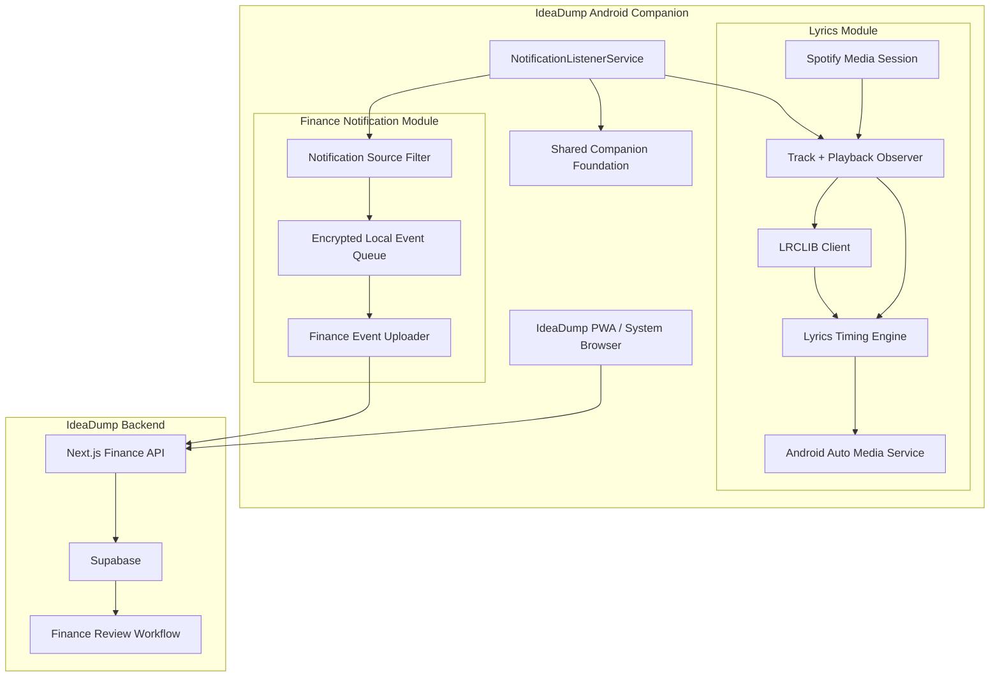

# PRD: IdeaDump Android Companion

- **Status:** Approved for implementation; physical acceptance pending
- **Owner:** Ashley
- **Last updated:** 2026-09-25
- **Related documents:** [Project README](../../README.md), [Finance Module](../FINANCE_MODULE.md), [Finance PRD](PRD_007.md). Source: `IdeaDump_Android_Companion_Compiled_PRD.md` supplied by Ashley on 2026-09-23.

## Summary

Build one native Android companion with two independent capabilities: synchronized Spotify lyrics from LRCLIB presented through an Android Auto media interface, and user-selected Finance notification capture into the existing IdeaDump review workflow. The modules share Android setup and lifecycle infrastructure while keeping their data, processing, storage, network destinations, and failures isolated. Reuse the existing IdeaDump PWA for Finance management, with two distinct current/next lyric fields on the target head unit as a required, still-unvalidated MVP outcome.

## Problem

IdeaDump currently supports Finance transaction entry through manual input and screenshot OCR, including Android PWA share-target processing. It does not currently ingest payment or banking notifications directly.

Separately, Android Auto does not expose Spotify lyrics through the normal Spotify car interface. A companion media app is required to observe Spotify playback, resolve timestamped lyrics, and expose a lyrics-oriented Android Auto presentation.

Creating two separate Android applications would duplicate setup, permissions, update management, and background infrastructure. A single IdeaDump Android Companion can host both features while retaining strict separation between them.

## Goals

- Provide one Android application for IdeaDump-native capabilities that cannot be implemented reliably by the existing PWA alone.
- Display the **current lyric line and next lyric line** on the target Android Auto head unit while Spotify remains the audio source.
- Automatically retrieve synchronized lyrics from **LRCLIB** using current-track metadata.
- Support Unicode lyric text, including English, Chinese, Korean, Japanese, and mixed-script songs.
- Capture notifications only from user-enabled Finance sources.
- Convert captured Finance notifications into durable intake events and submit them securely to IdeaDump.
- Ensure notification-derived transactions enter the existing Finance review and duplicate-detection workflow before becoming confirmed ledger entries.
- Keep Lyrics and Finance operationally independent, so failure or disablement of one feature does not stop the other.
- Reuse the existing IdeaDump PWA for Finance review, ledger management, settings, and other web functionality rather than rebuilding the full product natively.

## Non-Goals

- Replacing Spotify as the music player.
- Modifying Spotify's Android Auto UI.
- Screen mirroring or displaying arbitrary Compose layouts in Android Auto.
- Word-by-word karaoke animation.
- Automatic lyric translation or romanisation.
- Recording or analyzing device audio.
- Using private Spotify lyrics endpoints, account cookies, or screen scraping.
- Supporting every Android music player in the MVP.
- Supporting multiple Finance accounts within one monitored app in the MVP.
- Performing OCR on notification text.
- Direct bank API or open-banking integration.
- Automatically confirming notification transactions without passing the existing Finance review and duplicate policies.
- Collecting notifications from apps the user has not explicitly enabled.
- Building a separate native Finance dashboard that duplicates the existing IdeaDump PWA.
- Embedding the IdeaDump web product in a native WebView for the MVP.
- iOS support.
- Public Play Store release as an MVP requirement.

## Users and Access

| User or role | Allowed actions |
|---|---|
| IdeaDump authenticated user | Pair the companion with their IdeaDump account, enable Finance notification capture, review Finance data in the PWA, manage companion settings. |
| Android Auto user | Open the Lyrics media interface and use supported playback controls. |
| Device owner | Grant or revoke notification access and choose which Finance apps may be monitored. |

The Lyrics module must remain usable without Finance being enabled.

Finance notification capture requires an authenticated IdeaDump account with Finance module access.

## User Flow

### A. Initial Setup

1. User installs IdeaDump Companion.
2. App explains why notification access is required.
3. User grants Android notification-listener access.
4. App verifies whether Spotify media-session access is available.
5. If Finance capture is required, user opens IdeaDump in the browser, signs in, and approves pairing this Android installation with their account. The companion receives a scoped, revocable device credential.
6. User selects which installed apps are allowed as Finance notification sources.
7. Lyrics and Finance capture are enabled or disabled independently.
8. App reports readiness for:
   - Spotify playback observation.
   - Android Auto lyrics.
   - Finance notification capture.
   - IdeaDump synchronization.

### B. Lyrics Flow

1. User starts a song in Spotify.
2. Companion observes the Spotify media session.
3. Companion reads available metadata:
   - track title;
   - artist;
   - album;
   - duration;
   - playback position;
   - playback state.
4. Companion checks local lyric cache.
5. If no valid cached match exists, companion queries LRCLIB.
6. Synchronized lyrics are parsed into timed cues.
7. Timing engine determines:
   - current lyric cue;
   - next lyric cue.
8. Android Auto media metadata is updated.
9. User sees two lyric lines in the companion's Android Auto Now Playing surface where supported by the target head unit.
10. Pause, seek, resume, and track changes trigger resynchronization.

### C. Finance Notification Flow

1. A notification arrives from an app the user explicitly enabled for Finance capture.
2. Companion extracts only the configured notification fields required for Finance parsing.
3. Companion assigns a stable `client_event_id`.
4. Event is written to the local durable queue.
5. Background uploader sends the event to an authenticated IdeaDump Finance ingestion endpoint.
6. Server validates:
   - user identity;
   - Finance module access;
   - request schema;
   - idempotency key;
   - source ownership or mapping.
7. Server parses the event into a Finance candidate.
8. Existing Finance validation and duplicate assessment are applied.
9. Candidate is placed in Finance Review.
10. User confirms, edits, marks as duplicate, or rejects it in the existing Finance UI.

## Requirements

### Confirmed MVP scope

Ashley confirmed these product choices on 2026-09-23:

| Topic | Decision |
|---|---|
| Android versions | Minimum SDK 33; compile and target SDK 36. Validate on Android 13 and Android 16. |
| Initial Finance apps | Ryt and TNG use the supplied transaction examples. UOB remains visible but disabled until Ashley supplies a representative notification and its parser tests pass. |
| Account mapping | One account per supported app for the MVP, with one user-owned Finance source mapped to each selected package. Multi-account disambiguation is outside the initial scope. |
| Project location | Build the native Android companion as a subproject in this repository. The exact directory name and Android toolchain will be chosen during implementation. |
| Finance authentication | Use browser-based device pairing through the signed-in IdeaDump account, issuing a revocable credential scoped to the paired user/device and companion operations. Lyrics remains usable without pairing. |
| Web navigation | Open IdeaDump and Finance Review through the existing PWA or system browser. Verify installed-PWA routing and fall back to the browser where necessary. |
| Companion UI | Retain the proposed Home, Lyrics Settings, Finance Capture Settings, and Diagnostics. Pending uploads counts local events awaiting server acceptance, not transactions awaiting review. |
| Notification dates | Prefer explicit transaction dates; otherwise suggest the notification posted date in Asia/Kuala_Lumpur and show this provenance in review. |
| Raw text retention | Delete original notification text atomically when confirmed, rejected, or marked duplicate. Keep structured records and replay digests; never copy full notification text into correction excerpts or logs. |
| Delivery | Implement and commit validated slices throughout development on feat/android-companion-app. Deliver sideloadable test APKs; production deployment and physical acceptance are separate checkpoints. |
| Android Auto | The Android Auto version and target head unit are not yet known. The two-field display and Spotify playback continuity still require validation on the actual car. |

### Product Structure

The Android application is one installable app with three logical layers:

#### 1. Shared Companion Foundation

Responsible for:

- Notification listener registration.
- Application lifecycle.
- Local settings.
- Device pairing and authentication state.
- Secure local credential storage.
- Background work scheduling.
- Connectivity monitoring.
- Diagnostics.
- Navigation between native setup screens and the existing IdeaDump PWA or system browser.

#### 2. Lyrics Module

Responsible for:

- Observing Spotify's active media session.
- Reading track metadata and playback state.
- Resolving synchronized lyrics through LRCLIB.
- Parsing timestamped lyrics.
- Selecting the current and next lyric cues.
- Synchronizing cues to Spotify playback.
- Publishing Android Auto media metadata.
- Forwarding supported media controls to Spotify.

#### 3. Finance Notification Module

Responsible for:

- Receiving Android notification events.
- Filtering by user-enabled app packages.
- Extracting a bounded notification payload.
- Storing events in a durable local queue.
- Submitting events to IdeaDump using authenticated requests.
- Retrying transient failures safely.
- Preserving an idempotency identifier across retries.
- Surfacing capture and upload status without exposing sensitive notification content in logs.

### Shared Companion Requirements

| ID | Requirement | Acceptance |
|---|---|---|
| FR-001 | The Android app must provide independent toggles for Lyrics and Finance Notification Capture. | Disabling one feature does not disable the other. |
| FR-002 | The app must request notification-listener access through Android's system settings and explain why it is required. | The app detects granted/revoked state and displays a clear status. |
| FR-003 | Shared notification access must not imply shared processing. Notifications must be routed only to the module that requires them. | Finance notification bodies never enter the lyrics pipeline or LRCLIB requests. |
| FR-004 | Sensitive local secrets must use Android secure storage appropriate to the final authentication design. | No persistent authentication secret is stored as plain text. |
| FR-005 | Background failures must not crash or block unrelated features. | A failed Finance upload does not stop lyrics, and an LRCLIB failure does not stop Finance capture. |
| FR-006 | Logs must contain technical metadata only and must exclude full notification bodies, credentials, lyrics payloads, tokens, and financial secrets. | Diagnostic logs pass sensitive-data review. |

### Lyrics Requirements

#### Spotify Playback Observation

| ID | Requirement | Acceptance |
|---|---|---|
| FR-L001 | The app must identify Spotify as the configured media source and observe its active media session. | Spotify track and playback callbacks are received while Spotify is active. |
| FR-L002 | The app must exclude its own media session from source detection. | Companion metadata updates never cause recursive track detection. |
| FR-L003 | The app must read available title, artist, album, duration, playback state, position, speed, and supported media actions. | Available values are visible in diagnostics and update on track changes. |
| FR-L004 | Missing or invalid playback timing must produce a timing-unavailable state. | App does not fabricate position values or advance lyrics without a valid anchor. |

#### LRCLIB Lyrics Retrieval

| ID | Requirement | Acceptance |
|---|---|---|
| FR-L005 | LRCLIB is the default online lyrics provider for the MVP. | A supported track lookup can resolve LRCLIB lyrics without manual file import. |
| FR-L006 | Lookup must use title and artist, with album and duration included when available. | Request builder sends the best available metadata. |
| FR-L007 | Synchronized lyrics must be preferred over plain lyrics. | A result with usable synchronized lyrics becomes the active car-display source. |
| FR-L008 | Lyrics must be cached locally where permitted. | Replaying a previously resolved track can use the cached lyric record without another lookup. |
| FR-L009 | A manually confirmed local LRC file may override an online match. | User-selected local lyrics are used for the associated track. |
| FR-L010 | Stale lyric lookup results must be discarded after a track change. | Lyrics from a skipped track never replace the current track's presentation. |
| FR-L011 | The app must preserve returned Unicode text without forced translation or romanisation. | Chinese, Korean, Japanese, English, and mixed-script fixtures display without encoding corruption. |

#### Lyrics Synchronization

| ID | Requirement | Acceptance |
|---|---|---|
| FR-L012 | Parse timed lyric cues into an ordered timestamped model. | Valid synchronized LRC data produces deterministic cues. |
| FR-L013 | Current cue is the latest cue whose timestamp has been reached. | Controlled tests return the expected current cue. |
| FR-L014 | Next cue is the next cue at a later timestamp. | Same-timestamp duplicate content is not incorrectly treated as the next timed line. |
| FR-L015 | Pause freezes lyric progression. | Lines remain unchanged during paused playback. |
| FR-L016 | Seeking recomputes the lyric pair directly from the new position. | App does not step through skipped cues. |
| FR-L017 | Track changes immediately invalidate old timers and lyric state. | Previous-track text does not reappear after switching tracks. |
| FR-L018 | User must be able to apply a global lyric timing offset. | "Show lyrics earlier" and "Show lyrics later" controls alter cue selection predictably. |
| FR-L019 | Cue advancement must be calculated locally after lyrics are downloaded. | App does not perform a network call at every lyric change. |

#### Android Auto Presentation

| ID | Requirement | Acceptance |
|---|---|---|
| FR-L020 | Android Auto must expose the companion as a media app. | App appears and opens on the target head unit. |
| FR-L021 | The target presentation is two distinct lyric lines: current lyric and next lyric. | Actual head unit displays two usable text fields in the full Now Playing surface. |
| FR-L022 | First implementation should map current and next cues to supported display-title and display-subtitle metadata or equivalent supported fields. | Both fields update independently on validated hardware. |
| FR-L023 | The app must not depend on inserting newline characters into one field to simulate two lines. | Two-line acceptance requires two independently mapped fields. |
| FR-L024 | Spotify remains responsible for audio playback and audio focus. | Companion produces no duplicate audio. |
| FR-L025 | Supported play, pause, next, previous, and seek actions may be forwarded to Spotify exactly once. | Controlled transport tests produce one source action per user action. |
| FR-L026 | Android Auto output must use static cue replacement rather than word-level animation or app-driven scrolling. | No karaoke animation or custom moving text is used. |
| FR-L027 | If synchronized lyrics are unavailable, restore ordinary track metadata instead of fabricated lyrics. | Missing lyrics do not interfere with music playback. |

### Finance Notification Capture Requirements

#### Source Selection and Capture

| ID | Requirement | Acceptance |
|---|---|---|
| FR-F001 | Finance capture must be opt-in. | No Finance notification is processed until the feature is enabled. |
| FR-F002 | User must explicitly select which installed apps may be monitored for Finance events. | Notifications from non-selected packages are discarded from Finance processing. |
| FR-F003 | Package identity must be stored separately from the user-facing Finance source name. | Changing a display label does not silently change the Android package mapping. |
| FR-F004 | Notification capture must use Android notification-listener callbacks rather than screen scraping or accessibility automation. | Supported test notifications are received through the listener service. |
| FR-F005 | Capture only fields required for Finance parsing, such as package, notification key, title, text, subtext, post time, and safe metadata. | Captured payload matches the documented schema and excludes unrelated extras by default. |
| FR-F006 | Every captured event must receive a stable client-generated idempotency identifier. | Retrying the same local event uses the same `client_event_id`. |

#### Local Queue

| ID | Requirement | Acceptance |
|---|---|---|
| FR-F007 | Captured Finance events must be persisted before network submission. | Killing the app after capture does not lose a queued event. |
| FR-F008 | Queue entries must track pending, uploading, accepted, retryable-failure, and terminal-failure state. | Status can be inspected locally without reading sensitive payloads from logs. |
| FR-F009 | Transient network failures must retry using Android-supported persistent background work. | Failed uploads retry later without creating another local event. |
| FR-F010 | Successful server acceptance must retire the local queue item. | Accepted event is not uploaded again during normal operation. |
| FR-F011 | Permanent schema or authorization failures must stop automatic retry and expose a recoverable user-visible state. | Invalid events do not retry indefinitely. |

#### Backend Ingestion

| ID | Requirement | Acceptance |
|---|---|---|
| FR-F012 | Server must authenticate the companion request and verify Finance access for the user. | Unauthorized requests cannot create Finance intake records. |
| FR-F013 | Server must enforce idempotency by user and `client_event_id`. | Replaying the same event does not create another candidate. |
| FR-F014 | Notification ingestion must have its own parser path and must not invoke OCR or Tesseract. | Notification events are parsed directly from text fields. |
| FR-F015 | Parsed notification data must be normalized into the existing Finance candidate model. | Candidate can be displayed in the existing Finance Review page. |
| FR-F016 | Existing Finance validation rules must be applied to notification candidates. | Invalid amount, date, direction, source, or other constrained fields cannot bypass validation. |
| FR-F017 | Existing duplicate assessment must run before confirmation. | Notification candidate shows the same duplicate policy used by other Finance intake paths. |
| FR-F018 | MVP notification events must require review before ledger confirmation. | No newly received notification is silently inserted as a confirmed transaction. |
| FR-F019 | User corrections during review should remain eligible for the existing correction and rule-learning system where semantically applicable. | Confirmed notification candidates can produce normal correction evidence. |
| FR-F020 | Notification lineage must remain distinguishable from manual and screenshot intake. | Candidate or intake source records indicate `notification` as the origin. |

### Finance Parsing Behavior

Notification parsing should reuse Finance's deterministic principles but must not assume screenshots and notifications have identical text structures.

Expected extraction targets:

- amount;
- currency;
- direction;
- transaction date/time;
- merchant or payee;
- source;
- transaction reference when present;
- descriptive notes.

#### Parsing Rules

1. Source package provides strong evidence for Finance source mapping.
2. Explicit notification labels should take priority over heuristic interpretation.
3. Account balances, available balances, credit limits, and unrelated numeric values must not be treated as transaction amounts without supporting transaction context.
4. Transaction amount must satisfy existing Finance amount constraints.
5. Currency remains MYR for the current Finance product unless Finance itself is expanded.
6. Ambiguous events must go to review rather than being guessed.
7. A notification that cannot be confidently classified as a transaction may be ignored or retained as an explicitly failed/unsupported intake depending on the final UX decision.
8. Finance duplicate detection remains authoritative before confirmation.

### PWA Integration

The Android app should not replace the existing IdeaDump web product.

#### Native Responsibilities

- Permissions.
- Notification capture.
- Spotify media observation.
- Android Auto service.
- LRCLIB access.
- Local queue.
- Companion authentication/pairing.
- Background synchronization.
- Native settings required for Android-only capabilities.

#### Existing IdeaDump PWA Responsibilities

- Finance dashboard.
- Finance Review.
- Ledger.
- Sources.
- Categories.
- Rules.
- Manual entry.
- Screenshot OCR workflows.
- Other IdeaDump modules.

The Android app opens the existing IdeaDump PWA or the system browser. Validate routing to the installed PWA where supported and use the browser as the fallback. The Finance notification pipeline must continue independently after that web interface is closed.

### Companion UI

#### Home

Show feature cards:

```text
IdeaDump Companion

Lyrics
Spotify: Connected
Android Auto: Ready
Lyrics source: LRCLIB
[Open Lyrics Settings]

Finance Capture
Notification access: Granted
Monitored apps: 3
Pending uploads: 0
[Open Finance Capture Settings]

[Open IdeaDump]
```

#### Lyrics Settings

- Enable Lyrics.
- Spotify source status.
- LRCLIB status.
- Current track.
- Current / next lyric preview.
- Global timing offset.
- Local LRC override.
- Clear lyric cache.
- Android Auto diagnostics.

#### Finance Capture Settings

- Enable Finance capture.
- IdeaDump account/pairing status.
- Allowed app list.
- Pending queue count.
- Recent safe status history.
- Retry failed uploads.
- Revoke device pairing.
- Open Finance Review.

#### Diagnostics

Diagnostics may show:

- permission states;
- Spotify session status;
- Android Auto connection state where observable;
- lyric match source;
- timing offset;
- queue counts;
- last upload HTTP status;
- sanitized error codes;
- application/build information.

Diagnostics must not reveal sensitive notification text, tokens, financial account data, or full lyric payloads.

### Android Auto Display Contract

Target car presentation:

```text
CURRENT LYRIC LINE
NEXT LYRIC LINE
```

The product requirement is two independently updated text fields.

The exact visual styling is controlled by Android Auto and the head unit. The MVP must validate the implementation on the actual target car.

If the head unit does not expose two usable media metadata fields, the app may provide a single-line compatibility mode, but this does not satisfy the two-line acceptance criterion.

### Performance Requirements

#### Lyrics

- Do not fetch lyrics for every cue.
- Cache successful matches where allowed.
- Recalculate cue selection locally.
- Track-change state must invalidate old asynchronous work.
- Car metadata updates should occur when the presentation snapshot changes rather than at arbitrary high frequency.

#### Finance Capture

- Notification callback handling must remain lightweight.
- Persist first, upload asynchronously.
- Do not perform expensive parsing inside the notification listener callback.
- Backend parsing should remain deterministic and bounded.
- Queue retries must use backoff and must not create duplicate events.

## Data and Interfaces

- **Data:** Extend user-owned Finance intake and candidate lineage with paired devices and bounded notification events. Final retention and deletion periods remain open.
- **Interfaces:** A proposed notification endpoint, pairing/device-management endpoints whose exact routes remain to be designed, the Android local queue, Spotify playback observation, LRCLIB lookups, and Android Auto metadata publication.
- **Idempotency:** Persist `client_event_id` once per captured event; enforce replay and conflict handling per authenticated user. Notification update/repost identity remains an open decision.

### Repository integration baseline

Checked against the repository on 2026-09-23:

- The current Finance module documents manual entry and screenshot OCR, including Android PWA share batches. No Android app project or notification ingestion route was found in this checkout.
- [`FinanceIntakeItem` in `lib/types.ts`](../../lib/types.ts) already allows `screenshot` or `notification` as its intake source. This type allowance does not establish a working notification pipeline.
- `FinanceTransactionSource` and the source validator in [`lib/finance/core/auth.ts`](../../lib/finance/core/auth.ts) currently allow only `manual` and `screenshot`. Resolve how notification lineage reaches the ledger before implementation; FR-F020 requires distinguishable candidate or intake lineage, but does not by itself choose a new ledger source value.
- The [Finance module documentation](../FINANCE_MODULE.md) describes screenshot-oriented confirmation, OCR text in review, and OCR-scoped correction and parser-learning evidence. Adapt the relevant contracts to text intake without invoking OCR, inventing screenshot fields, or mixing notification evidence into screenshot learning indiscriminately.
- Reuse the existing candidate model, Finance validation, tenant ownership checks, and atomic duplicate recheck at confirmation. The companion authentication adapter must preserve these controls when device credentials are introduced.

The entity names, route names, and request below are proposals. The supplied draft is the product source; these repository observations describe integration work still required, not completed functionality.

### High-Level Architecture



### Existing IdeaDump Data

IdeaDump already has:

- Finance transactions.
- Finance sources.
- Finance categories.
- Finance review candidates.
- Duplicate assessment.
- Corrections.
- rules and learning.
- screenshot intake and processing records.

Notification ingestion should extend this system rather than create a second ledger.

### Proposed New Data

The exact schema may change during implementation, but the MVP requires durable notification lineage.

Suggested entities:

#### `finance_notification_devices`

Purpose:

- user/device pairing;
- credential lifecycle;
- device label;
- last-seen time;
- revocation status.

#### `finance_notification_events`

Purpose:

- idempotent event intake;
- original bounded notification payload;
- source package;
- captured timestamp;
- parse status;
- linked Finance candidate/intake;
- safe failure code.

Suggested fields:

```text
id
user_id
device_id
client_event_id
source_package
captured_at
posted_at
title
body
subtext
status
failure_code
candidate_id
created_at
updated_at
```

Unique constraint:

```text
(user_id, client_event_id)
```

Do not store unnecessary Android notification extras.

If the existing generic Finance intake model can safely accommodate notification lineage without weakening screenshot semantics, prefer extending that model rather than duplicating state machinery.

### API Interfaces

Existing Finance APIs remain unchanged unless specifically required.

New Android companion interface:

```text
POST /api/finance/notification-events
```

Potential supporting routes:

```text
POST   /api/companion/pair
POST   /api/companion/refresh
DELETE /api/companion/devices/:id
GET    /api/companion/devices
```

Browser-based device pairing is confirmed. Exact token issuance, expiry, refresh, revocation, and callback contracts remain implementation decisions; the route names above are proposals.

### Notification ingestion contract

Add a dedicated Finance notification ingestion contract rather than sending notification text through the existing OCR endpoint.

Proposed route:

```text
POST /api/finance/notification-events
```

Authentication must use the scoped, revocable device credential established through browser-based pairing. Exact token and request-security details remain to be designed.

Example conceptual request:

```json
{
  "client_event_id": "device-generated-stable-id",
  "captured_at": "2026-09-23T15:05:00+08:00",
  "source_package": "com.example.bank",
  "notification": {
    "title": "Payment successful",
    "text": "RM 25.90 paid to Example Merchant",
    "subtext": null,
    "posted_at": "2026-09-23T15:04:58+08:00"
  }
}
```

This schema is conceptual. Final fields must be validated against representative notification formats before implementation.

### Idempotency

#### Finance Notification Events

Each captured notification receives one stable `client_event_id`.

The identifier must:

- be generated once when the Android event is persisted;
- survive retries;
- remain unchanged after process restart;
- be scoped server-side to the authenticated user;
- never be regenerated solely because an upload failed.

Server behavior:

```text
same user + same client_event_id + same normalized payload
    -> return existing accepted result

same user + same client_event_id + conflicting payload
    -> return conflict
```

Candidate confirmation continues to rely on existing Finance atomic confirmation and duplicate recheck behavior.

#### Lyrics

Lyrics requests do not require financial-style idempotency. Use a stable normalized track key and generation/revision token so asynchronous results for old tracks are ignored.

## Security and Privacy

- **Authentication:** Lyrics does not require Finance pairing. Finance uses a scoped, revocable companion credential issued after the user signs in to IdeaDump in the browser and approves pairing this Android installation. Exact token mechanics remain to be designed.
- **Authorization:** Enforce Finance module access, device ownership, and tenant ownership for events, mappings, candidates, and linked records. Reuse repository authorization helpers and the existing server/database access model; new data must preserve tenant isolation and applicable RLS protections.
- **Sensitive data:** Encrypt transport and the local Finance queue; exclude unrelated notifications, OTPs, credentials, and full financial notification bodies from diagnostics. Define local/server retention, deletion, and backup behavior before implementation.

### Authentication

Finance capture requires browser-based pairing with an authenticated IdeaDump account that has Finance access. The resulting device credential permits background uploads independently of an open browser session.

Do not embed the Supabase service-role key, Render secret, or any server-only credential in the Android APK.

The paired-device credential must be:

- scoped to the paired user/device;
- revocable;
- securely stored;
- replaceable;
- limited to companion APIs rather than unrestricted backend access.

### Notification Access

Android notification access is broader than either feature requires.

The app must:

- clearly explain this during setup;
- process Spotify/media information only for Lyrics;
- process notification content only from Finance-enabled packages;
- immediately discard unrelated notification content;
- avoid retaining OTPs, messages, personal conversations, or unrelated notification bodies.

### Finance Data

Finance notification text may contain sensitive financial information.

Requirements:

- encrypted transport;
- secure local storage;
- no notification bodies in logs;
- no notification bodies sent to LRCLIB;
- no financial data included in crash-report breadcrumbs unless explicitly sanitized;
- server-side ownership checks on every Finance operation.

### Lyrics Data

LRCLIB requests may include:

- title;
- artist;
- album;
- track duration.

Finance data must never be included in LRCLIB requests.

## Failure and Edge Cases

| Scenario | Expected behavior |
|---|---|
| Notification access revoked | Both dependent features show unavailable state. Finance queue remains locally preserved where possible. |
| Spotify is not running | Lyrics shows no active source. Finance remains operational. |
| Spotify metadata missing | Lyrics lookup waits or shows ordinary playback metadata rather than guessing. |
| LRCLIB unavailable | Use valid cached/local lyrics if available, otherwise show lyrics unavailable. |
| LRCLIB returns plain lyrics only | Do not invent timing. Car falls back to normal track information. |
| Wrong lyric match | User can correct the match on the phone while parked. |
| Track skipped while lookup is pending | Old result is discarded using the track revision token. |
| Playback paused | Lyrics freeze. |
| Playback seek | Cue pair is recalculated from the new position. |
| Android Auto only shows one text field | Mark two-line compatibility as failed for that head unit. Do not treat wrapped text as equivalent. |
| Finance notification from non-enabled app | Discard from Finance processing. |
| Notification contains no transaction information | Ignore or mark unsupported according to final capture policy. |
| Notification text is redacted by Android | Do not bypass redaction. Mark event unusable or skip it. |
| Network offline after Finance notification | Keep event queued locally and retry later. |
| Same notification uploaded twice | Server returns the existing event result through idempotency handling. |
| Device credential revoked | Stop Finance uploads and prompt re-pairing. Lyrics continues functioning. |
| Finance backend unavailable | Queue remains pending. Lyrics continues functioning. |
| PWA/browser closed | Notification capture and lyrics continue independently of UI. |
| App process recreated | Restore enabled settings and durable Finance queue; rebuild Lyrics state from current Spotify session. |

## Delivery

This is a draft product specification. The Android APIs, two-field car presentation, authentication design, and notification formats still require implementation validation.

- **Migrations:** Additive forward migrations may be required for device pairing, notification lineage, and reviewed extensions to existing intake or confirmation contracts. Do not rewrite applied migrations.
- **Environment:** No new variable names are confirmed. Document final server-only variable names and purpose when the pairing credential design is finalized, without secret values.
- **Deployment order:** First validate Spotify continuity and the two-field presentation on the target Android Auto head unit, and validate representative Ryt, TNG, and UOB notification formats. Then deploy additive database changes, compatible authenticated backend and Finance Review changes, and finally distribute the Android APK built from this repository's Android subproject. The release channel remains open.
- **Rollback:** Disable companion ingestion and Finance capture without affecting existing manual, screenshot OCR, or PWA share-target workflows. Keep additive data and lineage intact; handle pending local events under the agreed queue policy.

### Database

Potential forward migration for:

- companion device records;
- notification event lineage;
- optional extension of Finance intake source types.

Do not edit previously applied migrations.

### Application

Changes are expected in:

```text
Android subproject in this repository (directory name to be selected)
app/api/finance/
lib/finance/
supabase/migrations/
document/
```

If notification parsing is reused by both Next.js and another service, place the parser in a shared pure module rather than duplicating logic.

### Environment

Do not add server secrets to the Android build.

Any new server-side environment values should be documented by variable name only in the PRD and repository documentation.

### Rollback

The feature must be disableable without impacting existing Finance manual entry, screenshot OCR, or PWA share-target workflows.

Database additions should be additive so existing Finance paths remain operational if Android notification ingestion is turned off.

## Verification

- **Automated:** Run the Android and backend scenarios below. For future application changes, complete `npm audit`, `npm audit --omit=dev`, `npm run lint`, `npx tsc --noEmit`, `npm test`, and `npm run build` on the repository runtime. If shared OCR code changes, also run the Finance OCR audit, typecheck, test, and build checks from `services/finance-ocr/`. Android build and test commands will be documented once its project is created.
- **Browser:** Verify `/finance/review` confirmation, edits, rejection, duplicate handling, and missing-field recovery on mobile and desktop. Check `/finance/transactions`, `/finance/settings`, `/finance/add`, companion-to-PWA navigation, access denial, and existing manual, screenshot, and PWA share flows. Verify pairing/device-management screens once their routes are agreed.
- **Data:** Verify user/device ownership, cross-tenant denial, stable event identity, replay without another candidate, conflict detection, review-only intake, durable lineage, atomic confirmation, and agreed retention/deletion behavior. Confirm unrelated notifications and credentials do not enter stored Finance events or logs.
- **Device:** The physical-device checks and MVP acceptance table below are required. A single-field head unit does not pass the two-field lyric criterion.

### Automated

Android:

- lyric parser tests;
- cue-selection tests;
- pause/seek/track-change tests;
- stale-result cancellation tests;
- Unicode lyric tests;
- Finance package-filter tests;
- local queue persistence tests;
- idempotency tests;
- retry-state tests;
- sanitized logging tests.

IdeaDump backend:

- authentication tests;
- Finance authorization tests;
- notification request schema tests;
- idempotent replay tests;
- conflicting-idempotency tests;
- notification parser fixtures;
- source mapping tests;
- duplicate-detection integration tests;
- Finance Review integration tests;
- tenant-isolation tests.

Existing Finance test suites must continue passing.

### Device

Run the applicable scenarios on Android 13 and Android 16. Use Ryt, TNG, and UOB notifications with one mapped Finance source per app. Record the phone models, Android Auto version, head unit, and connection type when testing car compatibility.

Test:

- notification access setup;
- Spotify detection;
- phone screen off;
- app process recreation;
- network loss and restoration;
- multiple Finance notifications;
- same notification retry;
- source-app enable/disable;
- Android Auto wired connection where supported;
- Android Auto wireless connection where supported;
- actual head-unit two-line display;
- English lyrics;
- Simplified or Traditional Chinese lyrics;
- Korean lyrics;
- Japanese lyrics;
- mixed-script lyrics;
- long lyric lines;
- skipped tracks;
- pause/resume;
- forward/backward seeking.

### MVP Acceptance Criteria

| ID | Acceptance criterion |
|---|---|
| AC-001 | One Android APK contains both Lyrics and Finance Notification Capture. |
| AC-002 | Lyrics and Finance can be enabled or disabled independently. |
| AC-003 | Spotify continues playing while the companion is selected in Android Auto. |
| AC-004 | Target head unit shows the current lyric and next lyric as two distinct usable fields. |
| AC-005 | Lyrics remain synchronized across normal playback, pause, resume, seek, and track change. |
| AC-006 | LRCLIB can resolve supported synchronized lyrics automatically. |
| AC-007 | English, Chinese, Korean, Japanese, and mixed Unicode lyric fixtures render without encoding corruption. |
| AC-008 | Missing or incorrect lyrics fail gracefully without affecting Spotify playback. |
| AC-009 | Finance captures notifications only from explicitly enabled applications. |
| AC-010 | A captured Finance notification survives app/process restart before upload. |
| AC-011 | A retry uses the same stable client event identifier and does not create a duplicate server event. |
| AC-012 | Notification ingestion does not invoke OCR. |
| AC-013 | Notification-derived transactions appear in the existing Finance Review workflow. |
| AC-014 | Existing Finance validation and duplicate assessment are applied before confirmation. |
| AC-015 | Finance upload failure does not interrupt the Lyrics module. |
| AC-016 | Lyrics provider failure does not interrupt Finance capture. |
| AC-017 | Unrelated notifications are not persisted or uploaded. |
| AC-018 | Sensitive notification contents and credentials are absent from diagnostic logs. |
| AC-019 | Existing manual, screenshot OCR, and PWA share-target Finance flows continue working without regression. |
| AC-020 | The companion continues functioning when the IdeaDump PWA is closed, except for UI actions that explicitly require the web interface. |

### Definition of Done

The MVP is complete when one IdeaDump Android Companion application can:

1. Observe Spotify playback.
2. Retrieve synchronized lyrics from LRCLIB.
3. Keep lyrics synchronized to Spotify playback.
4. Display the current and next lyric lines as two distinct fields on the validated Android Auto head unit.
5. Capture transaction notifications only from user-selected Android apps.
6. Persist and securely submit those events to IdeaDump.
7. Create reviewable Finance candidates using the existing validation and duplicate controls.
8. Operate both features independently without requiring the IdeaDump PWA to remain open.
9. Preserve privacy boundaries between lyrics, Finance data, unrelated notifications, and server credentials.

## Open Decisions

The implementation plan was approved on 2026-09-25. The confirmed scope table and the decisions below supersede earlier conceptual alternatives in the supplied draft.

- **Pairing:** Five-minute browser-approved pairing requests, app-held verifier, one-time exchange, and opaque revocable device credentials stored as hashes server-side. The credential allows notification intake, active source selection, and self-revocation only. No general API-key or WebView-cookie access.
- **Mapping:** Configure one owned Finance source per enabled package in native Finance Capture Settings. Preserve the source selected when an event was captured; validate ownership again on upload and confirmation.
- **Filtering:** Discard OTPs, promotions, unrelated events, group summaries, and redacted text before persistence. Transaction-like events with incomplete fields enter manual review.
- **Queue:** Persist before upload, retain identifiers across retries, pause capture and upload when disabled, resume interrupted work, and remove local payloads after durable acceptance. Stop capture with a visible error at 1,000 queued events instead of silently deleting data. Queue ownership never changes across account switches.
- **Lineage:** Use notification event records linked to the existing intake and candidate model. Add notification ledger origin and parser-aware review/retry behavior. Keep structured corrections separate from OCR-only learning evidence.
- **Lyrics:** Use Spotify observation, Media3, local cue selection, synchronized LRCLIB results, user-confirmed LRC overrides, and a global offset from -5 to +5 seconds in 100 ms steps. Only unique supported matches are accepted automatically.
- **Notification fixtures supplied:** TNG: "XXX has transferred RM X.XX to you. Tap here to check the transaction details" (income). Ryt: "You've sent RM X.XX to XXX on XXX, 1:25pm (GMT+8) using your main account" (expense). Replace placeholders with fictional values in tests; the Ryt date placeholder does not establish an exact live date format.
- **Hardware evidence remaining (Ashley):** Test APKs on Android 13, Android 16, and the actual car. Record phone models, Android Auto version, head unit, and wired/wireless connection. Two fields and uninterrupted Spotify audio must pass; no single-line substitute qualifies.
- **UOB evidence remaining (Ashley):** Supply a sanitized transaction notification before enabling UOB.
- **Distribution:** Sideload test APKs first. Production signing material stays outside Git; production deployment and signing configuration are not implied by source implementation.
